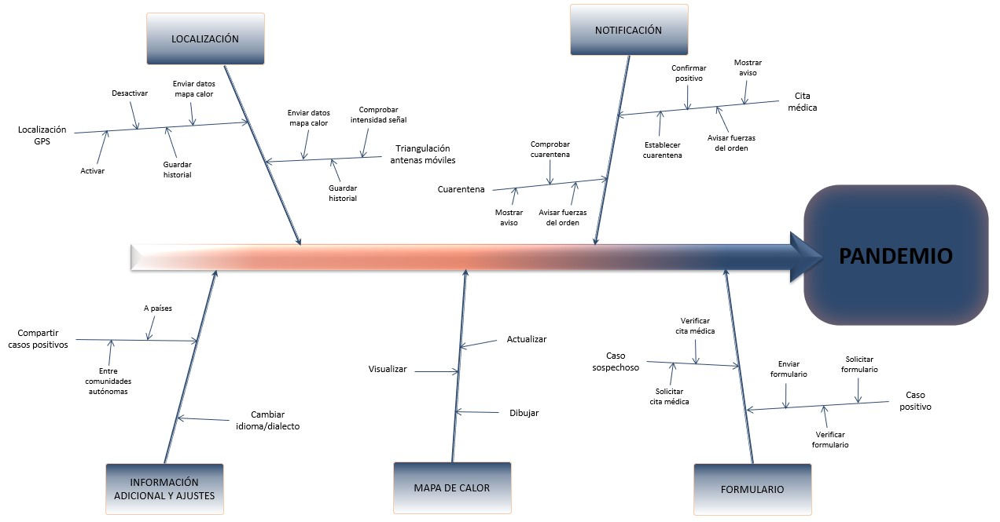

# PRÁCTICA DE MODELADO
# 1 INTRODUCCIÓN
A finales de diciembre de 2019 se identificaron en Wuhan, en la provincia china de Hubei, 41 casos de neumonía. Un análisis más exhaustivo mostró que se trataba de un nuevo caso de coronavirus que fue denominado SARS-CoV-2, o como comúnmente se conoce, Covid-19.

Cuando se detectaron los primeros casos, nadie podía imaginar que, unos meses más tarde, concretamente el 11 de marzo de 2020, la Organización Mundial de la Salud (OMS) declararía que el nuevo brote de coronavirus constituía una pandemia debido a que esta nueva enfermedad ya estaba presente en los seis continentes del planeta.

Actualmente hay más de 50 millones de casos confirmados en todo el planeta (y más de un millón de muertos relacionados con esta enfermedad) por lo que los países han tenido que tomar diferentes medidas como los cierres de fronteras o el confinamiento de la población para intentar aplanar la curva de incidencia del virus y evitar su rápida propagación. 

Además, ahora que se van conociendo más detalles de esta nueva enfermedad: cómo se propaga, cómo podemos reducir el número de contagios, síntomas relacionados, etc., están surgiendo diferentes sistemas software, como Radar Covid, para rastrear y gestionar la información de los ciudadanos con el fin de aplanar la curva de incidencia e intentar erradicar esta pandemia o posibles pandemias que surjan en el futuro. 

Sin embargo, ninguna de las aplicaciones actuales está teniendo los resultados que se esperaban ya que ninguna es obligatoria o se basan en software que no toda la población conoce, y por este motivo nace la aplicación de Pandemio.

Pandemio será una plataforma que permitirá rastrear y gestionar la información de los ciudadanos de la próxima pandemia con el fin de reducir el impacto de la pandemia en la población y así evitar tomar decisiones extremas como el confinamiento domiciliario de la población.

En este documento se especifican los aspectos más destacados de Pandemio, confiando en que sirvan como punto de partida para llevar a cabo un análisis detallado de los requisitos de este proyecto. Esta especificación de requisitos debe ser suficientemente precisa como para afrontar, en fases posteriores, el diseño y la implementación del proyecto.

 

### 1.1 Alcance
Dado que lo que se busca con esta aplicación es el control total sobre el contagio y expansión de la pandemia, se buscará alcanzar al máximo de la población posible, en este caso el 100% de las personas que utilizan dispositivos móviles.

Deberemos para ello crear una nueva aplicación móvil que llamaremos Pandemio y llevar a cabo un proceso judicial con el objetivo de que Pandemio sea instalada en todos los dispositivos móviles de forma obligatoria, ya sea a través de Google en los Android, o de Apple en dispositivos iOS.

Una vez tengamos la certeza de que la aplicación está instalada en todos los dispositivos móviles, el objetivo es controlar a las personas diagnosticadas como positivas en la próxima pandemia y a las personas a las que hayan podido contagiar, usando para ello la ubicación del teléfono, o en su defecto, por medio de una triangulación a través de las antenas de telefonía móvil siempre que se pueda obtener un margen de error pequeño a la hora de ubicar a las personas. En cualquier caso, se descarta el uso del Bluetooth por todos los inconvenientes que genera en las aplicaciones móviles que existen actualmente.

Por otro lado, habrá que considerar la posibilidad de que un caso positivo en la próxima pandemia o un contacto estrecho se desplace entre comunidades autónomas o incluso a otros países. La aplicación tendrá bases de datos independientes para cada comunidad autónoma ya que la gestión de la sanidad en cada una de ellas es diferente, por lo que en caso de que se produzca un desplazamiento de este tipo se deberá advertir a los sistemas sanitarios de aquellos lugares a los que se ha desplazado el caso positivo. En caso de permanecer en España podremos seguir su movimiento a través de Pandemio, pero en caso de salir a otro país se avisará a las autoridades sanitarias del país correspondiente y pasaría a ser de su responsabilidad.

Desde Pandemio se crearán citas médicas automáticas para que los contactos estrechos de un caso positivo acudan a realizarse las pruebas médicas oportunas, y en caso de que no acudan, se informará a las fuerzas del orden (policía local, nacional, guardia civil o al ejército) para que vayan a investigar el motivo. Además, desde Pandemio se tratará de controlar si un caso positivo está cumpliendo o no la cuarentena.

Surge también el problema en cuanto al rastreo de personas que no utilizan dispositivos móviles. Tenemos que aceptar este hecho, intentando tener cierto seguimiento a través de sus familiares o personas cercanas, por lo que se incluirá la posibilidad de informar de un caso positivo/sospechoso por si una persona tiene a su cargo a otra que no dispone de dispositivo móvil. Esto supone que el personal sanitario y las fuerzas del orden deberán tener un mayor control sobre este grupo de población. 

Siendo conscientes de que el rastreo de la ubicación y los movimientos de la población puede verse como una invasión a su intimidad, nos comprometemos a respetar en todo momento la Ley de Protección de Datos y a almacenar los datos de cada usuario solo el tiempo que sea necesario para el rastreo de la enfermedad. A los datos sanitarios solo tendrán acceso el personal sanitario y las fuerzas del orden, mientras que los usuarios de Pandemio solo podrán ver un mapa de calor con las zonas por las que se ha movido una persona con diagnóstico positivo, pero siempre respetando el anonimato y la confidencialidad de los usuarios de la aplicación.

En cuanto al mantenimiento y actualizaciones de la aplicación, el objetivo inicial es obtener un producto final por lo que no serían necesarias, aunque Pandemio estaría abierto a versiones y actualizaciones en caso de necesidad.

A continuación mostramos el árbol de características con las primeras funcionalidades que se esperan de Pandemio tras la primera entrevista y que iremos completando a medida que avance el proyecto.

  

 

### 1.2 Objetivos
En la siguiente tabla se describen los principales objetivos que se esperan alcanzar de Pandemio cuando se termine de implementar:
 | ID | OBJETIVO |
 | :--: | :----- |
 | **OB_01** | Mejorar las aplicaciones existentes en la lucha contra una futura pandemia. |
 | **OB_02** | Alcanzar el 100% de la población que disponga de dispositivos móviles. |
 | **OB_03** | Alcanzar el mayor número de población posible. |
 | **OB_04** | Rastrear y gestionar la información de los usuarios de forma anónima. |
 | **OB_05** | Preservar la privacidad de los usuarios. |
 | **OB_06** | Reducir el impacto de futuras pandemias en la sociedad. |
 | **OB_07** | Automatizar el proceso de citaciones para realizar pruebas médicas. |
 | **OB_08** | Informar a los usuarios que deben acudir a realizarse pruebas médicas. |
 | **OB_09** | Avisar a las fuerzas del orden si un usuario no acude a realizarse las pruebas médicas. |
 | **OB_10** | Avisar a las fuerzas del orden si un usuario no cumple con la cuarentena que se le ha impuesto. |
 | **OB_11** | Coordinar los diferentes servicios sanitarios y autoritarios de las distintas comunidades autónomas. |
 | **OB_12** | Verificar que los usuarios cumplen las cuarentenas que deban hacer. |
 | **OB_13** | Rastrear a los contactos estrechos de los usuarios. |
 | **OB_14** | Mostrar un mapa de calor con las zonas de movilidad de los casos positivos. |
