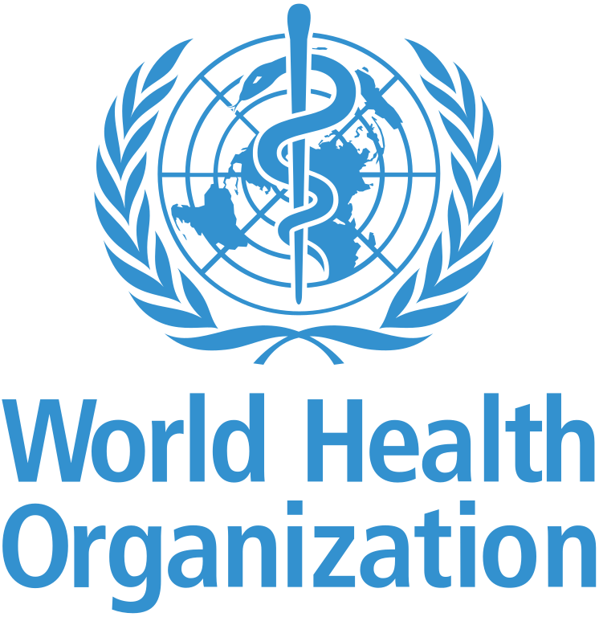

# PRÁCTICA DE MODELADO
## 2 INFORMACIÓN DEL DOMINIO DEL PROBLEMA
Desde comienzos del año 2020 el mundo se encuentra sumergido en una pandemia global debido al coronavirus COVID-19. Actualmente, en España, como modo de rastreo del virus y como ayuda a los ciudadanos, se han creado diferentes sistemas software para intentar reducir el impacto que está provocando esta pandemia, pero sin los resultados que se esperaban.
Pandemio tratará de mejorar los sistemas existentes para que en una futura pandemia estemos más preparados para combatirla, para que el alcance de reproducción de la enfermedad disminuya (y con ello el número de contagios y muertes provocadas por ella) y no sea necesario tomar medidas extremas como el confinamiento domiciliario de todo el país lo que supondría un desastre económico y el empobrecimiento de la población.

### 2.1 Introducción al Dominio del Problema
Para la pandemia en la que nos encontramos, cuando una persona comienza a presentar síntomas de la enfermedad o ha estado en contacto con una persona diagnosticada como positiva, debe permanecer en cuarentena y acudir al centro de salud para realizarse pruebas médicas. Estas pruebas consisten en realizarse un test rápido (que en caso de dar positivo se confirma que la persona presenta el coronavirus) y/o una PCR para confirmar los resultados obtenidos por el test rápido si se ha obtenido un negativo o no se lo ha realizado por algún motivo. Además, aunque se obtenga una PCR negativa, es necesario realizar una cuarentena de unos 10 días para evitar posibles falsos negativos. A los 10 días se realiza una nueva PCR para poder dar el alta médica a esa persona.
En la actualidad todo este proceso de citación y rastreo de personas se realiza de forma manual, en cambio, con Pandemio se tratará de automatizar todo el proceso. Además, el cumplimiento de la cuarentena no se puede verificar por ningún medio efectivo que no conlleve un gran gasto de tiempo por parte del personal sanitario o de los cuerpos de policía, por lo que Pandemio se intentará automatizar en los casos que sea posible (con huella dactilar o por reconocimiento facial con el dispositivo móvil, enviando ubicación a horas aleatorias, etc.).

### 2.2 Glosario de términos

A continuación, se presenta una lista ordenada alfabéticamente con los principales términos, acrónimos y abreviaturas específicos del dominio del problema.

* **Aplanar la curva de incidencia:** El objetivo para luchar contra una enfermedad es reducir el número de contagiados. La curva de la gráfica de contagio se aplana cuando deja de crecer el número de contagiados y se dibuja algo así como una 'meseta'. Es la forma gráfica de ver que, durante un periodo de tiempo, el número de contagios se mantiene y no se incrementa, lo que significa que la velocidad de los contagios es menor y, por tanto, que se ha frenado la tendencia al alza. El aislamiento sanitario, las pruebas médicas y las medidas sanitarias que se toman tienen como intención aplanar la curva de contagios.

* **Bluetooth:** Especificación industrial para redes inalámbricas de área personal (WPAN) creado por Bluetooth Special Interest Group, Inc. que posibilita la transmisión de voz y datos entre diferentes dispositivos mediante un enlace por radiofrecuencia en la banda ISM de los 2.4 GHz. Los principales objetivos que se pretenden conseguir con esta norma son:
  - Facilitar las comunicaciones entre equipos móviles.
  - Eliminar los cables y conectores entre estos. 
  - Ofrecer la posibilidad de crear pequeñas redes inalámbricas y facilitar la sincronización de datos entre equipos personales.
  
* **Caso sospechoso:** Se considerará a una persona caso sospechoso cuando presente los síntomas habituales y más característicos asociados a la enfermedad.
  
* **Caso sospechoso (COVID-19):** Cuadro clínico de infección respiratoria aguda de aparición súbita de cualquier gravedad que cursa, entre otros, con fiebre, tos o sensación de falta de aire, y que pueden estar asociados o no a síntomas graves como dificultad respiratoria o neumonía. Otros síntomas atípicos como la odinofagia (dolor de garganta al ingerir), anosmia (pérdida de olfato), ageusia (pérdida de gusto), dolores musculares, diarreas, dolor torácico o cefaleas, entre otros, pueden ser también considerados como síntomas de sospecha de infección de Covid-19.

* **Contacto estrecho:** Persona que haya tenido una exposición a la enfermedad de forma que las posibilidades de contagio sean altas y por tanto se le deban hacer las pruebas pertinentes y mantener bajo observación.

* **Contacto estrecho (COVID-19):** Persona que haya coincidido con un caso diagnosticado como COVID positivo, permaneciendo a menos de 2 metros, durante más de 15 minutos, sin mascarilla y durante las 48 horas previas a la fecha del diagnóstico. Si todas las personas usaron mascarillas en todo momento, se mantuvo la distancia de seguridad y el espacio estuvo ventilado no se considerarían contactos estrechos. 

* **Contagio:** Transmisión de una enfermedad por contacto con el agente patógeno que la causa. (El coronavirus tiene un alcance de reproducción de 2,68 según la revista científica Lancet. Es decir, cada persona contagiada llega a contagiar a 2,68 personas, un índice relativamente alto, lo que ha facilitado su expansión por el mundo.)

* **Coronavirus:** Gran familia de virus que pueden provocar enfermedades tanto a animales como a humanos. Se sabe que, en los humanos, todos los virus de esta familia pueden causar infecciones respiratorias, que pueden ir desde un resfriado normal a una enfermedad grave, como son la SRAS, la MERS o el Covid-19. La primera vez que se habló de este tipo de virus fue en la revista Nature el 16 de noviembre de 1968. Los investigadores lo llamaron 'coronavirus' porque la forma del virus al microscopio era como similar al de la corona solar como podemos observar en la imagen.

* **COVID-19:** Enfermedad infecciosa causada por el coronavirus SARS-CoV-2 y que se ha descubierto recientemente. El origen léxico del Covid-19 proviene de 'co', en alusión a la forma de corona solar del virus, 'vi' que corresponde a la palabra virus y 'd' que hace referencia a enfermedad ("disease" en inglés). Finalmente se le puso el número 19 por el año en que se detectó en seres humanos.

* **Cuarentena:** Se trata de un aislamiento preventivo durante un tiempo determinado con el objetivo de evitar el contagio de ciertas enfermedades. Lo llevan a cabo personas que están en su domicilio porque poseen confirmación médica de haber contraído una enfermedad o porque están esperando un diagnóstico definitivo (en el caso del Covid-19, a la espera de PCR/test rápido por ser un caso sospechoso o ser un contacto estrecho). No tienen por qué ser 40 días exactos. De hecho, para el caso del Covid-19 suele rondar los 10 días. 

* **Estado de alarma:** En España se declara en todo el país (o en parte de este) mediante un decreto del consejo de ministros en el caso de calamidades, desgracias públicas como inundaciones, terremotos o crisis sanitarias como la que vivimos por culpa del coronavirus. Esta disposición permite limitar la libre circulación de las personas, intervenir industrias, requisar temporalmente bienes, y limitar o racionar los servicios o el consumo de artículos de primera necesidad. Además, permitiría realizar los cambios legales que fueran necesarios para poder obtener los datos de localización de los dispositivos móviles que poseen las diferentes operadoras, e incluso de los fabricantes de teléfonos y sistemas operativos (Google, Apple, etc.).

* **Incubación:** Se trata del tiempo comprendido entre la exposición a un organismo patogénico y el momento en que los síntomas aparecen por primera vez. En el caso del coronavirus, el tiempo de incubación es de 5,4 días de media, aunque se han observado casos en que el periodo de incubación es de hasta 14 días.

* **Organización Mundial de la Salud (OMS):** Organismo especializado de las Naciones Unidas creado en 1946 con el propósito fundamental de alcanzar para todos los pueblos el grado más alto posible de salud. Coordina programas encaminados a solucionar problemas sanitarios y se ocupa de la inmunización, la educación sanitaria y el suministro de medicamentos esenciales.

* **Pandemia:** Tal y como establece la OMS, se llama pandemia a la propagación a gran velocidad y a escala mundial de una nueva enfermedad. Lo que la diferencia de la epidemia es el grado en que aumentan los casos y su alcance internacional. La OMS declaró al Covid-19 como pandemia el 11 de marzo de 2020 cuando se extendió por los seis continentes y se certificaron contagios en más de 100 países de todo el planeta.

* **PCR:** La reacción en cadena de la polimerasa, conocida como PCR por sus siglas en inglés (polymerase chain reaction), es una técnica de la biología molecular desarrollada en 1986 por Kary Mullis. Su objetivo es obtener un gran número de copias de un fragmento de ADN particular, partiendo de un mínimo; en teoría basta partir de una sola copia de ese fragmento original, o molde. En algunos casos, como en la actual epidemia de coronavirus SARS-CoV-2, se están empleando las PCR para detectar, confirmar o descartar la presencia del coronavirus en el organismo ya que esta prueba de diagnóstico permite localizar y amplificar un fragmento del material genético de un patógeno o microorganismo, que en el caso del coronavirus es una molécula de ARN. El Ministerio de Sanidad subraya en el documento de Estrategia de detección precoz, vigilancia y control del Covid-19 que las muestras recomendadas para la PCR son del tracto respiratorio superior e inferior:
  - Superior: exudado preferiblemente nasofaríngeo y orofaríngeo o exudado nasofaríngeo. 
  - Inferior: preferiblemente lavado broncoalveolar, broncoaspirado, esputo (si es posible) y/o aspirado endotraqueal, especialmente en pacientes con enfermedad respiratoria grave. 
  
  Así, la toma de la muestra se obtiene inclinando ligeramente la cabeza del paciente hacia atrás, se introduce un hisopo o bastoncillo en la garganta, hasta la faringe, y se rota o da vueltas de cinco a 10 segundos, aunque también se puede tomar la muestra del interior de la nariz, por lo que se introduce el bastoncillo por un orificio nasal unos cinco o siete centímetros hasta la nasofaringe y se gira durante unos segundos para obtener el tejido necesario.
  
  En el siguiente enlace se puede ver cómo se debe realizar una PCR: [Link](https://www.youtube.com/watch?v=Yf-HDkJGW08 "¿Cómo se realiza una prueba PCR?").

* **Test rápido:** Este nuevo test rápido de antígenos es una nueva prueba de la que disponemos que nos permite detectar el Covid-19 desde el mismo inicio del contacto con una altísima fiabilidad, muy similar a la que nos ofrecerá una PCR, pero con obtención de resultados en apenas 15 minutos. Los test rápidos se realizan con muestras de exudados de la nariz y del fondo de la garganta –que se toman con un bastoncillo o hisopo– y en ellos se detectan la posible presencia de antígenos, es decir, permiten detectar si hay presencia del virus SARS-CoV-2 en el paciente por medio de alguno de sus componentes, como por ejemplo, por sus proteínas.

 

> En la siguiente imagen podemos ver las principales diferencias entre la técnica de la PCR y los test rápidos en el diagnóstico del Covid-19:

  

  

  

* **Vacuna:** Se trata de una sustancia compuesta por microorganismos atenuados o muertos que se introduce para estimular la formación de anticuerpos y conseguir inmunidad frente a ciertas enfermedades. Hasta la fecha no existe ninguna vacuna ni medicamento antiviral específico para prevenir o tratar el COVID-19.
