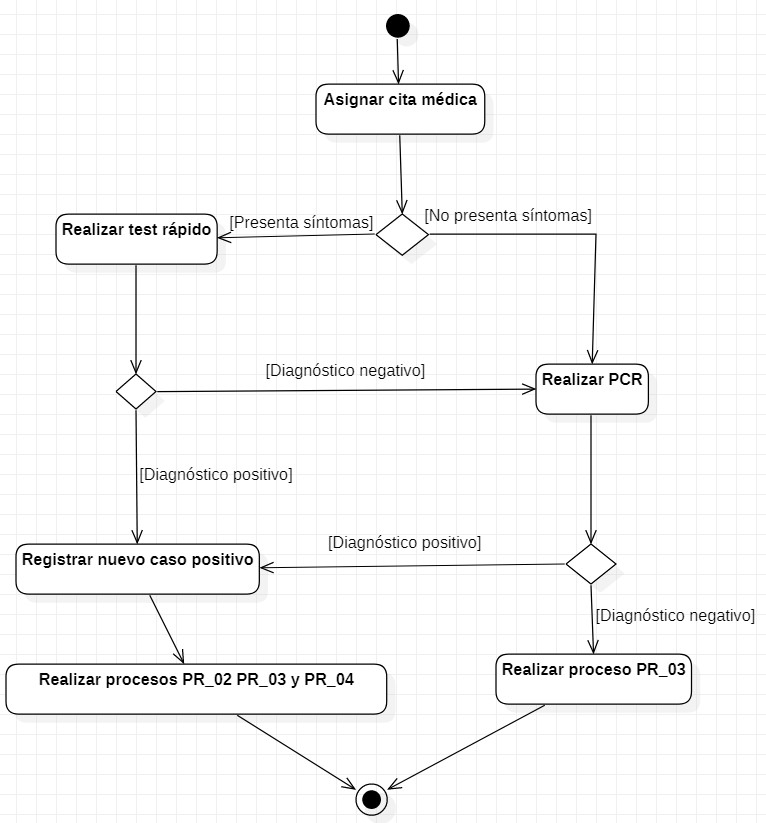

# PRÁCTICA DE MODELADO
# 3 DESCRIPCIÓN DE LA SITUACIÓN ACTUAL 

El Gobierno de España decidió comenzar a utilizar la aplicación Radar Covid a nivel nacional como parte de las principales soluciones para frenar la pandemia ya que en otros países de la Unión Europea había tenido bastante éxito. Para usar Radar Covid en cada comunidad autónoma, cada una de ellas debía comunicar al Ministerio de Sanidad su uso, y tras comprobar que todo estaba en orden, pedía a la Secretaría de Estado de Inteligencia Artificial (dependiente del Ministerio de Asuntos Económicos y Transformación Digital) que comenzara la integración técnica. Para esta integración técnica, cada comunidad autónoma debía crear un protocolo propio dentro de sus sistemas sanitarios para enviar los códigos a los contagiados (que identifican anónimamente a los casos positivos y permiten informar a sus contactos estrechos sin desvelar la identidad de los casos positivos) y formar a los rastreadores para que pudieran utilizar de la mejor manera posible la información que reciben de la aplicación. Sin embargo, todo este proceso de puesta en marcha fue bastante lento ya que intervinieron gran cantidad de actores. 

Hoy en día, Radar Covid ya se está usando a nivel nacional pero no se están consiguiendo los resultados que se esperaban por diversos motivos como son:
  * El número de descargas de la aplicación es muy bajo ya que es una aplicación de uso voluntario y además se le ha dado poca publicidad en los medios nacionales.
  * A nivel de la población el conocimiento de la tecnología médica en España es insuficiente.
  * La dificultad para comunicar un positivo. Esto se debe a que los sanitarios deben proporcionar a los usuarios diagnosticados como positivos un código para insertar en la aplicación, y sin embargo muchos sanitarios desconocen la existencia de estos códigos. Además, la colaboración por parte de las Comunidades Autónomas no está siendo la adecuada, y surgen continuamente problemas en la generación de códigos ya que la gestión de los datos entre las diferentes comunidades no está estandarizada.
  * Está basada en el uso de Bluetooth, lo que la hace inservible si el Bluetooth está apagado o bien, ocupado con los auriculares u otra aplicación.
  
  
  Como apenas se está utilizando esta aplicación, los sanitarios y rastreadores deben rastrear de forma manual los contactos estrechos de cada paciente que es diagnosticado como positivo. Todo esto supone una gran pérdida de tiempo porque si Radar Covid estuviera funcionando en todos los dispositvos móviles se podría automatizar este proceso.  Además, como este rastreo se hace de forma manual, es necesario crear también de forma manual las citas médicas para las personas que deban acudir a realizarse las pertinentes pruebas médicas.
  
  Cabe destacar el hecho de que actualmente si una persona no acude a realizarse las pruebas médicas, son los sanitarios los encargados de llamar a la persona para comprobar porque no ha acudido y en numerosas ocasiones no los localizan, pero en ningún momento se avisa a las fuerzas del orden para que vayan a ver que sucede. 
  
  Finalmente, todas las personas que se realizan test rápidos o PCR deben guardar una cuarentena de aproximadamente 10 días hasta que vuelvan a dar negativo en una segunda PCR, y son los propios sanitarios los encargados de comprobar que las personas están realizando la cuarentena. Este proceso se realiza llamando a cada una de las personas por teléfono pero debido a que el número de personas que deben realizar las cuarentenas cada vez es mayor, se intenta llamar a todos varias veces pero con preferencia sobre los casos positivos.
  
Por todo ello y más, nace Pandemio, que tratará de rastrear y gestionar la información de los ciudadanos de la próxima pandemia de una forma más eficaz y eficiente.
Para ello es necesario conocer en detalle la situación actual para evitar cometer los mismos errores de Radar Covid en Pandemio y mejorar lo que ya es positivo.

 

## 3.1 Pros y contras de la Situación Actual
En esta sección señalaremos los principales aspectos positivos y negativos de Radar Covid con el fin de conservar sus fortalezas, pero corrigiendo las debilidades que la han llevado a fracasar para que no suceda lo mismo con Pandemio. De esta forma se podrá automatizar la mayoría de los procesos, y conseguir una mejor gestión de una futura pandemia y un menor impacto en la población:

### 3.1.1 Fortalezas de la Situación Actual

Algunos de los aspectos positivos de Radar Covid que convendría que se mantuvieran en Pandemio son los siguientes:

| ID | NOMBRE | DESCRIPCIÓN |
| :----- | :----- | :----- |
| **FO_01** | Anonimato | La aplicación funciona sin revelar la identidad del usuario ni la del teléfono móvil. Además, no registra datos personales ni de geolocalización. |
| **FO_02** | Alertas rápidas | Rápido aviso al usuario de que ha estado en contacto con un positivo cercano para que comience la cuarentena cuanto antes y disminuya sus contactos sociales. |
| **FO_03** | Discreción | Las alertas de exposición se envían sin indicar el lugar ni momento concreto donde se produjo la exposición. |
| **FO_04** | Descentralización de los datos | Los datos de cada usuario solo se guardan en su teléfono móvil. |
| **FO_05** | Encriptación de los datos | La conexión entre los teléfonos móviles y el servidor es privada. |
| **FO_06** | Interfaz amigable | Fácil uso de la interfaz. |
| **FO_07** | Sección de ayuda | Tiene sección de preguntas y enlaces de interés acerca de la enfermedad. |
| **FO_08** | Varios idiomas | Posibilidad de usar la aplicación en varios dialectos (catalán, euskera, gallego y valenciano) e idiomas (español e inglés). |
| **FO_09** | Gratuita | Es gratuita y fácilmente instalable. |
| **FO_10** | Anonimato | Es posible comunicar de forma anónima el diagnostico positivo de una prueba PCR o un test rápido. |
| **FO_11** | Consumo de datos nulo | No consume ningún dato de las tarifas telefónicas. |
| **FO_12** | Código abierto | El código fuente de la aplicación de rastreo está publicado en GitHub para que cualquier desarrollador externo pueda notificar errores y colaborar. |
 

### 3.1.2 Debilidades de la Situación Actual

Por el contrario, también hay que destacar los principales aspectos negativos de Radar Covid que consideramos que no deben repetirse en Pandemio:

| ID | NOMBRE | DESCRIPCIÓN |
| :---: | :----- | :----- |
| **DE_01** | Descarga y uso voluntario | La instalación y el uso de la aplicación no son obligatorios lo que dificulta el rastreo del virus en la población ya que solo un pequeño porcentaje de la población la usa diariamente. |
| **DE_02** | Sanitarios poco familiarizados con la App | No todo el personal sanitario está familiarizado con el funcionamiento de la aplicación y muy pocos hacen uso de ella. |
| **DE_03** | Desconocimiento de la App | Gran parte de la población no conoce la existencia de la aplicación. |
| **DE_04** | Vulnerabilidad a ataques | El uso del Bluetooth provoca que los teléfonos móviles sean más vulnerables a ataques informáticos. |
| **DE_05** | Funcionamiento basado en Bluetooth y GPS | La aplicación hace uso del Bluetooth para su correcto funcionamiento y generalmente suele estar apagado u ocupado por otros dispositivos. Esto provoca que las aplicaciones actuales no funcionen correctamente y que el rastreo del virus sea aún más complicado. Además, hay teléfonos móviles que aún no tienen buenos servicios de GPS incorporados. |
| **DE_06** | Incompatibilidad entre Apps | El uso del Bluetooth en varias aplicaciones puede generar problemas de incompatibilidad entre ellas y que los sistemas software no funcionen correctamente. |
| **DE_07** | Desconocimiento del Bluetooth | Mucha gente mayor no conoce cómo funciona el Bluetooth por lo que las aplicaciones que se basan en Bluetooth pierden su potencial. |
| **DE_08** | Desconocimiento del propio teléfono móvil | Mucha gente de avanzada edad desconoce cómo usar los teléfonos móviles y como descargar aplicaciones. |
| **DE_09** | Nula estandarización | Las bases de datos de las diferentes administraciones no están estandarizadas lo que provoca que muchos usuarios no puedan informar de su resultado positivo si se mueven entre distintas comunidades. |

Además, debemos destacar otros aspectos negativos de la situación actual que Radar Covid no se encarga de manejar y que convendría que lo hiciera Pandemio:

| ID | NOMBRE | DESCRIPCIÓN |
| :---: | :----- | :----- |
| **DE_10** | Comprobación cuarentena | Actualmente los sanitarios llevan solo el seguimiento de la cuarentena de los casos positivos y negativos por teléfono cada 2-3 días, aunque no pueden confirmar la ubicación de la persona de ninguna manera. |
| **DE_11** | Asistencia "voluntaria" | En caso de que una persona no acuda a realizarse las oportunas pruebas médicas, los sanitarios solo pueden tratar de ponerse en contacto por teléfono con la persona y en numerosas ocasiones no responden. En ningún momento se pide ayuda a las fuerzas del orden. |
 

## 3.2	Modelos de Procesos de Negocio Actuales

En la lucha contra el Covid-19 intervienen gran cantidad de actores ya que cada uno tiene su función para evitar reducir el impacto de la pandemia en la población. Hay que destacar el trabajo de los sanitarios, rastreadores y fuerzas del orden que se encuentran en primera línea en esta lucha contra el virus. Para conseguirlo, se llevan a cabo varios procesos como son la realización de pruebas médicas o el rastreo de contactos estrechos que se detallan más adelante.

### 3.2.1 Descripción de los Actores de Negocio Actuales

Los principales actores de negocio que intervienen en la actualidad en la lucha contra el Covid-19 son: 

| **ID** | **Nombre** | **Descripción** |
| :---: | :--- | :--- |
| **AC_01** | Gobierno de España | Es el órgano que se encarga de decidir en última instancia el confinamiento domiciliario de una localidad o del país. Además, se encargó de que Radar Covid se comenzará a utilizar en España así como de permitir e impulsar su uso. |
| **AC_02** | Secretaría de Estado de Digitalización e Inteligencia Artificial del Gobierno de España | Esta secretaría, dependiente del Ministerio de Asuntos Económicos y Transformación Digital, es la encargada de personalizar la aplicación de Radar Covid para España (ya que es una aplicación que se usa en toda Europa y tiene su origen fuera de España) e integrarla en los servicios sanitarios de cada comunidad autónoma. Además, es la encargada de impulsar la aplicación en España y subsanar cualquier brecha de seguridad que pudiera surgir. |
| **AC_03** | Sanidad de cada CCAA | Actualmente la Sanidad de España está transferida, por lo que cada comunidad autónoma debe decidir sus protocolos a seguir cuando el número de contagios crece, aunque en algunas ocasiones debe pedir la aprobación del Gobierno de España. Además se encarga de crear los protocolos de Radar Covid dentro de cada comunidad autónoma, de formar a los sanitarios y a los rastreadores, y comunicarse con otras comunidades autónomas cuando existen casos que se mueven entre distintas comunidades autónomas. |
| **AC_04** | Sanitarios y rastreadores | Son los encargados de generar los códigos para los ciudadanos que hayan obtenido un resultado positivo ya que los usuarios que usan la aplicación no los pueden generar por sí mismos. Además, son los encargados de rastrear el virus y los posibles contactos estrechos que hayan mantenido los ciudadanos con una persona con diagnóstico positivo. También se encargan de comprobar si está realizando la cuarentena o no. |
| **AC_05** | Fuerzas del orden | Son los encargados de que se cumplan las normas impuestas por cada CCAA o por el Gobierno y de multar a aquellos que las incumplan. También se encargan de controlar la circulación de los ciudadanos cuando existen restricciones de movilidad.  |
| **AC_05** | Usuarios de la app Radar Covid | Debido a que Radar Covid es una aplicación de uso voluntario, es necesario que los ciudadanos se descarguen esta aplicación y la usen correctamente. Deben usar el Bluetooth y el GPS, y son los encargados de comunicar su positivo a través de la aplicación cuando han obtenido un diagnóstico médico positivo para lograr un mejor rastreo del virus en la población. |

### 3.2.2 Descripción de Procesos de Negocio Actuales

Para el rastreo y gestión de la pandemia Covid se llevan a cabo los siguientes procesos:

| **PR_01** | **Realizar pruebas médicas** |
| :---: | :--- |
| **Descripción** | Cuando una persona es considerada contacto estrecho se le asignará una cita médica. Cuando acude a la cita médica, si presenta síntomas se le realiza un test rápido y si el resultado es positivo se confirma que la persona tiene COVID-19, en caso de resultado negativo se realizará una prueba PCR para confirmarlo. Si no tiene síntomas se le realiza directamente una prueba PCR. A continuación, se seguirán los procesos oportunos dependiendo si los resultados de las pruebas médicas han sido negativos o positivos. |

En el siguiente diagrama de actividad podemos ver un resumen de este proceso:

 

| **PR_02** | **Asignar código** |
| :---: | :--- |
| **Descripción** | Después de que un paciente haya acudido a realizarse una prueba médica, los sanitarios comprueban el resultado. Si el resultado de la prueba es positivo, tienen que solicitar al sistema un código que el paciente podrá introducir voluntariamente en la aplicación Radar Covid. |

En el siguiente diagrama de actividad podemos ver un resumen de este proceso:

 

| **PR_03** | **Establecer cuarentena y seguimiento** |
| :---: | :--- |
| **Descripción** | Tras realizarse las pruebas médicas, independientemente de que el resultado sea positivo o negativo, la persona deberá cumplir un periodo de cuarentena de aproximadamente 10 días. Entre el séptimo y el décimo se realizará una segunda prueba PCR que determinará, en caso de positivo, una ampliación de la cuarentena y, en caso de negativo, se dará el alta médica y la persona podrá hacer vida normal. Actualmente los sanitarios llevan el seguimiento por teléfono de la cuarentena de todos los casos confinados (haciendo incapié en los positivos) cada 2-3 días, aunque no pueden confirmar de ninguna forma la ubicación de la persona. |

En el siguiente diagrama de actividad podemos ver un resumen de este proceso:

 

| **PR_04** | **Rastrear contactos** |
| :---: | :--- |
| **Descripción** | Cuando una persona da positivo los sanitarios deben rastrear los contactos estrechos de esta persona, para ello preguntarán al paciente con quién ha estado los dos días antes de tener síntomas Covid. Una vez recogidos estos datos, los sanitarios llaman de forma individual a cada uno de estos contactos y conciertan citas para realizar las pruebas médicas siguiendo el procedimiento PR_01. En caso de que un caso confirmado positivo se haya desplazado o haya estado en otra comunidad autónoma dos días antes de conocer que ha sido positivo, se avisará al cuerpo sanitario de dicha comunidad para que realicen el rastreo y las pruebas médicas oportunas.  |

En el siguiente diagrama de actividad podemos ver un resumen de este proceso:

 

| **PR_05** | **Comprobar medidas sanitarias** |
| :---: | :--- |
| **Descripción** | Diariamente las autoridades sanitarias de cada CCAA revisan la incidencia de la pandemia en la población, y en función de los datos obtenidos se toman diferentes medidas como pueden ser el cierre perimetral de la localidad, cierre de la hostelería, limitación de movimiento entre provincias/CCAA, confinamiento domiciliario. |

En el siguiente diagrama de actividad podemos ver un resumen de este proceso:

 

## 3.3 ENTORNO TECNOLÓGICO ACTUAL

Radar Covid es una aplicación de código abierto que podemos encontrar en el siguiente link: [https://github.com/RadarCOVID](https://github.com/RadarCOVID) y utiliza el protocolo abierto 'Decentralized Privacy-Preserving Proximity Tracing' (DP-3T, estilizado como dp3t), que fue desarrollado en respuesta a la pandemia Covid-19 para facilitar el rastreo de contactos digitales de los participantes infectados. 

Cuando dos usuarios que tienen Radar Covid activado se encuentran, si permanecen juntos durante un tiempo superior a 15 minutos, sus teléfonos móviles intercambian los números identificadores de la aplicación y los almacenan localmente en sus registros de contacto. 

Cuando uno de ellos obtiene un resultado positivo en un análisis médico, si introduce un código en la aplicación (este código se lo proporcionan los sanitarios), se envía un informe a un servidor central informando de su caso de manera anónima. 

Continuamente la aplicación recopila los informes del servidor de forma automática y comprueba si algún identificador contenido en el informe del servidor se encuentra entre sus registros de contacto locales. Si encuentra alguna coincidencia, entonces el usuario ha estado en contacto cercano con un paciente diagnosticado como positivo, y es advertido por la aplicación. Puesto que cada dispositivo verifica localmente los registros de contacto, y por lo tanto los registros de contacto nunca se transmiten a terceros, el servidor de informes central no puede por sí mismo determinar la identidad o el registro de contacto de cualquier usuario de la aplicación.

El protocolo de enlace del dispositivo utiliza Bluetooth Low Energy para encontrar e intercambiar detalles entre los usuarios de la aplicación que se encuentren en un rango cercano, y la fase de notificación de infecciones utiliza HTTPS para cargar el informe en un servidor central de Amazon Web Services.

Finalmente, el código fuente de la aplicación está escrito en su mayoría en Kotlin (lenguaje de programación con tipo estático desarrollado por JetBrains y que se utiliza con mayor frecuencia para complementar o reemplazar Java en aplicaciones empresariales y de usuario final) y XML para la parte de cliente, y Java para la parte de servidor, y utiliza SQL para realizar las búsquedas en las bases de datos. 

### 3.3.1 Descripción del Entorno de Hardware Actual

El entorno hardware de Radar Covid consiste en los teléfonos móviles de cada usuario, en los servidores de Amazon Web Services y en los ordenadores de los centros de salud y hospitales que generan los códigos que los contactos positivos pueden introducir voluntariamente en la aplicación.

Además, también podemos destacar los ordenadores del Gobierno de España, concretamente los de la Secretaría de Estado de Inteligencia Artificial, encargados del mantenimiento y buen funcionamiento de la aplicación en todo momento. 

### 3.3.2 Descripción del Entorno de Software Actual

El entorno software de Radar Covid es bastante simple a nivel de usuario final ya que se trata de una aplicación móvil disponible en Android e iOS y para su correcto funcionamiento solo es necesario el uso del Bluetooth y del GPS. 

La gestión de los datos está basada en el modelo descentralizado ya que los datos de cada usuario se guardan en cada teléfono móvil. Los pocos datos que se comparten con la aplicación están alojados en los servidores de Amazon Web Services y la subida de datos al servidor se hace con un software de la compañía estadounidense de forma cifrada y anónima para guardar la confidencialidad y el anonimato de los usuarios de la aplicación.

Finalmente también es necesario un programa generador de códigos que utiliza el personal sanitario cuando un ciudadano obtiene un resultado positivo en un test rápido o en una PCR. Este código generado es el que se le da al ciudadano para que lo registre voluntariamente en su aplicación de Radar Covid y se avise a todas las personas que hayan estado más de 15 minutos con él.
