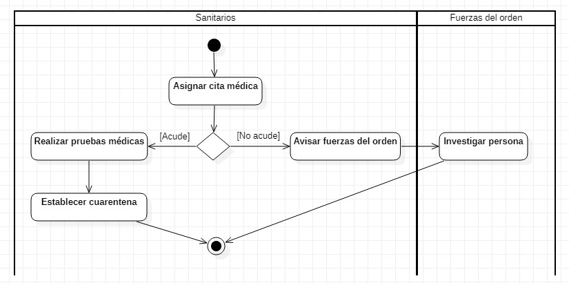
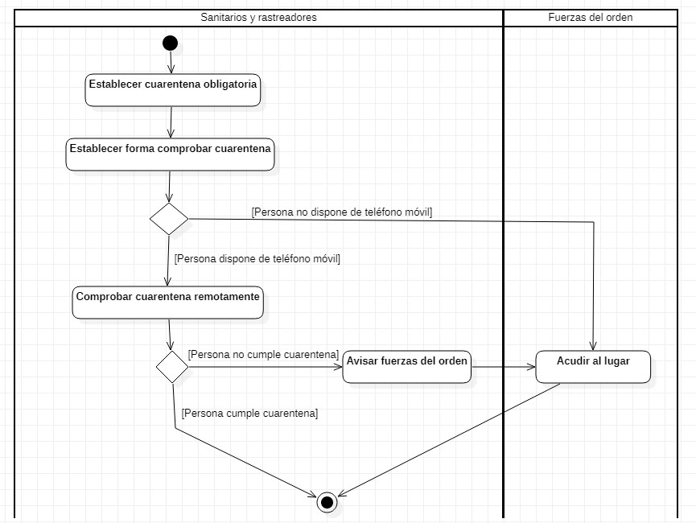
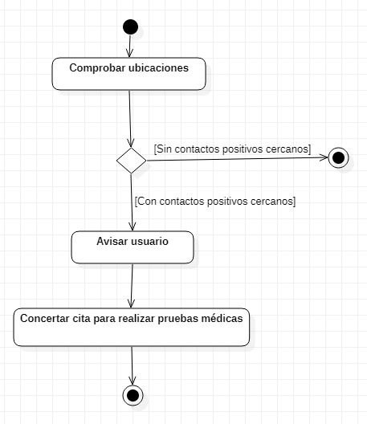

# 4 NECESIDADES DE NEGOCIO

Dado que la actual pandemia provocada por el Covid-19 está dejando datos muy preocupantes: gran número de contagiados y de muertes, UCIs por encima de su capacidad máxima, gran número de operaciones pospuestas por falta de espacios en los hospitales, etc. y las aplicaciones que existen actualmente como Radar Covid no terminan de ayudar en la lucha para frenar la expansión del Covid-19, es necesario crear una nueva aplicación software que mejore la anterior y que ayude a reducir el impacto de una futura pandemia en la sociedad, ya que una mala gestión en una pandemia peor podría ser catastrófica. 

## 4.1 Objetivos de negocio

En la siguiente tabla se describen los principales objetivos que se esperan alcanzar de Pandemio cuando se termine de implementar:
 
 | **OB_01** | Mejorar las aplicaciones existentes en la lucha contra una futura pandemia. | 
 | :--: | :----- |
 | **Descripción** | [Añadir una descripción que tenga que ver con el problema] |
  | **Subobjetivos** | - Automatizar los procesos de negocio actuales (Ver 3.2.2) |
  | **Importancia** | Alta |
  | **Prioridad** | Media |
 
 
 > Dentro de cada objetivo el orden es Descripcion - Importancia - Prioridad - Subobjetivos
 
  | ID | OBJETIVO | 
 | :--: | :----- |
 | **OB_01** | Mejorar las aplicaciones existentes en la lucha contra una futura pandemia. Alta - Media - Automatizar los procesos de negocio actuales (Ver 3.2.2) |
 | **OB_02** | Alcanzar el 100% de la población que disponga de teléfonos móviles. Alta - Alta - Lograr la instalación obligatoria de la app |
 | **OB_03** | Alcanzar el mayor número de población posible. Alta - Media - Crear campañas publicitarias para fomentar el aviso de positivos de personas sin acceso a teléfonos móviles|
 | **OB_04** | Rastrear y gestionar la información de los usuarios de forma anónima. Alta - Media - Gestionar las sesiones de usuario para restringir el acceso a los datos/Almacenar los datos de ubicación en la base de datos solo durante el tiempo de vida útil|
 | **OB_05** | Preservar la privacidad de los usuarios. Media - Media - Restringir el acceso a los datos|
 | **OB_06** | Reducir el impacto de futuras pandemias en la sociedad. Alta - Media - Reducir la mortalidad / Reducir el número de contagios |
 | **OB_07** | Automatizar el proceso de citaciones para realizar pruebas médicas. Media - Baja - Generar cita médica al validar los formularios recibidos |
 | **OB_08** | Informar a los usuarios que deben acudir a realizarse pruebas médicas. Media - Media|
 | **OB_09** | Avisar a las fuerzas del orden si un usuario no acude a realizarse las pruebas médicas. Baja - Baja - Automatizar el proceso de notificación a las autoridades|
 | **OB_10** | Avisar a las fuerzas del orden si un usuario no cumple con la cuarentena que se le ha impuesto. Media - Baja - Automatizar el proceso de notificación a las autoridades|
 | **OB_11** | Coordinar los diferentes servicios sanitarios y fuerzas del orden de las distintas comunidades autónomas. Media - Baja|
 | **OB_12** | Verificar que los usuarios cumplen las cuarentenas que deban hacer de forma automática. Baja - Baja - Introducir la verificación por medio de huella dactilar ó facial / Realizar llamadas aleatorias a casos positivos para confirmar su posición.|
 | **OB_13** | Rastrear a los contactos estrechos de los usuarios. Media - Media|
 | **OB_14** | Mostrar un mapa de calor con las zonas de movilidad de los casos positivos. Baja - Baja - Almacenar historial de ubicación de usuarios positivos / Gestionar el historial de información / Utilizar mapas actualizados |
 
 
 
 ## 4.2 Modelos de Procesos de Negocio a Implantar 

Con el fin de cumplir todos los objetivos expuestos anteriormente, y sobre todo con el fin de reducir el impacto de una posible pandemia en el futuro, se deberán implantar nuevos actores o modificar las tareas que realizan los ya existentes, y crear o cambiar algunos procesos de los que se están siguiendo para la pandemia del Covid-19.

### 4.2.1 Descripción de los Actores de Negocio a Implantar

Los principales actores de negocio que se cambiarán sus funciones una vez terminado el proyecto son los siguientes: 

| **ID** | **Nombre** | **Descripción** |
| :---: | :--- | :--- |
| **ACI_01** | Gobierno de España | Es el órgano que se encargará de tomar las decisiones que afecten a todo el país como es la implantación de Pandemio en todos los dispositivos móviles o el confinamiento domiciliario de una localidad o del país. También se encargará de impulsar las nuevas médidas que se tomen y de crear algunos de los protocolos que puedan utilizar las CCAA. |
| **ACI_02** | Secretaría de Estado de Digitalización e Inteligencia Artificial del Gobierno de España | Esta secretaría, dependiente del Ministerio de Asuntos Económicos y Transformación Digital, será la encargada de gestionar todo lo que tenga que ver con la aplicación de Pandemio. Esto incluirá la gestión de la aplicación y la subsanación de cualquier brecha de seguridad que pudiera surgir. |
| **ACI_03** | Sanidad de cada CCAA | Actualmente la Sanidad de España está transferida y en futuro cercano seguirá así, es por ello que se encargará de crear los protocolos sanitarios dentro de cada comunidad autónoma o de asumir aquellos impuestos por el Gobierno, de formar a los sanitarios y a los rastreadores en la lucha contra la nueva pandemia, y de comunicar a otras comunidades autónomas cuando existan casos que se muevan entre distintas comunidades autónomas. |
| **ACI_04** | Sanitarios y rastreadores | Serán los encargados de realizar las pruebas médicas oportunas, y de avisar a las fuerzas del orden si alguien no acude a realizarse dichas pruebas estando citado para ello. Además se encargarán de comprobar que aquellas personas que deben guardar cuarentena lo están cumpliendo realmente. De no ser así, se encargarán de avisar a las fuerzas del orden para que acudan a ver que sucede. |
| **ACI_05** | Fuerzas del orden | Al igual que ahora, serán los encargados de que se cumplan las normas impuestas por cada CCAA o por el Gobierno y de multar a aquellos que las incumplan. También se encargarán de controlar la circulación de los ciudadanos cuando existan restricciones de movilidad. Finalmente, tendrán que acudir a ver porque una persona no ha asistido a las pruebas médicas oportunas si reciben un aviso de los sanitarios y de comprobar el cumplimiento de las cuarentenas de aquellas personas que no dispongan de teléfonos móviles. |
| **ACI_06** | Usuarios de la app Pandemio | Serán los encargados de comunicar casos sospechosos o positivos de familiares que no dispongan de teléfonos móviles como pueden ser niños pequeños o ancianos dependientes. |

Además, debemos destacar la presencia de un nuevo actor de negocio que en la actualidad casi no tiene peso en la lucha contra el Covid-19 pero que deberá asumir más tareas en una futura pandemia a pesar de que la Sanidad este transferida (y en caso de no estarlo, desarrollar todas las funciones de ACI_03):

| **ID** | **Nombre** | **Descripción** |
| :---: | :--- | :--- |
| **ACI_07** | Ministerio de Sanidad | Será el encargado de impulsar el uso de Pandemio por medio de campañas publicitarias para que los usuarios que tengan a su cargo a personas sin teléfonos móviles informen de casos sospechosos o positivos. |

### 4.2.2 Descripción de Procesos de Negocio a Implantar

Para el rastreo y gestión de una futura pandemia se llevarán a cabo los siguientes procesos:

| **PRI_01** | **Realizar pruebas médicas** |
| :---: | :--- |
| **Descripción** | Cuando una persona sea considerada contacto estrecho se le asignará una cita médica automáticamente. Si acude a la cita médica, se seguirán los procesos oportunos dependiendo si los resultados de las pruebas médicas han sido negativos o positivos (dependerá de las pruebas que se realicen) y se establecerá una cuarentena para evitar la expansión de la enfermedad, y en caso de no acudir, se avisará a las fuerzas del orden para que vayan a ver qué sucede. |

En el siguiente diagrama de actividad podemos ver un resumen de este proceso:

 

| **PRI_02** | **Establecer cuarentena y seguimiento** |
| :---: | :--- |
| **Descripción** | Independientemente de que el resultado sea positivo o negativo, la persona deberá cumplir un periodo de cuarentena del número de días que se considere necesario. Durante esta cuarentena, se realizará el control de la cuarentena de forma remota en caso de que la persona disponga de teléfono móvil, y en caso de no tenerlo, las fuerzas del orden acudiran a ver si se está cumpliendo. Si al realizar el control de la cuarentena de forma remota se detecta que la persona no la está cumpliendo, se avisar a las fuerzas de orden para que vayan a ver el motivo y sancionar a la persona. |

En el siguiente diagrama de actividad podemos ver un resumen de este proceso:

 

| **PRI_03** | **Rastrear contactos** |
| :---: | :--- |
| **Descripción** | En esta ocasión será la aplicación de Pandemio la que se encargue de forma automática del rastreo de los contactos. Para ello comprobará el historial de ubicaciones del usuario y si la aplicación detecta que el usuario ha estado cerca de una persona que ha dado positivo en las pruebas médicas oportunas, avisará al usuario y creará una cita médica automaticamente para que se realice las pruebas médicas oportunas. |

En el siguiente diagrama de actividad podemos ver un resumen de este proceso:

 

| **PRI_04** | **Comprobar medidas sanitarias** |
| :---: | :--- |
| **Descripción** | Este proceso es igual al que existe en la actualidad (PR_05): Diariamente las autoridades sanitarias de cada CCAA revisarán la incidencia de la pandemia en la población, y en función de los datos obtenidos se tomarán diferentes medidas como pueden ser el cierre perimetral de la localidad, cierre de la hostelería, limitación de movimiento entre provincias/CCAA, confinamiento domiciliario. |

En el siguiente diagrama de actividad podemos ver un resumen de este proceso:

 
