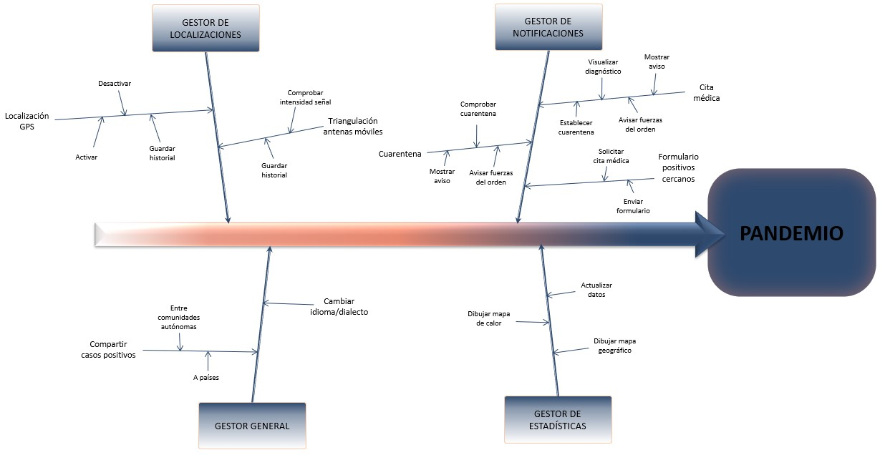

# 5. DESCRIPCIÓN DE LOS SUBSISTEMAS DEL SISTEMA A DESARROLLAR 

A continuación, mostramos el árbol de características con las primeras funcionalidades que se esperan de Pandemio tras la primera entrevista realizada al ministro y que iremos completando a medida que avance el proyecto:

  

 

Además, en las siguientes tablas se trata de realizar una descripción detallada de los diferentes subsistemas a desarrollar que se observan en el árbol de características de Pandemio. 

|**SUB_01**| Gestor de localizaciones |
| :---: | :--- |
|**Dependencias**| Los objetivos de negocio de los que depende son:   + OB_02 - Alcanzar el 100% de la población que disponga de teléfonos móviles. + OB_04 - Rastrear y gestionar la información de los usuarios de forma anónima.  + OB_06 - Reducir el impacto de futuras pandemias en la sociedad.  + OB_11 - Verificar de forma automática que los usuarios cumplen las cuarentenas impuestas.  + OB_12 - Rastrear a los contactos estrechos de los usuarios.    Los procesos de negocio a implantar de los que depende son:   + PRI_02 - Establecer cuarentena y seguimiento.  + PRI_03 - Rastrear contactos.  + PRI_04 - Comprobar medidas sanitarias.|
|**Descripción**| Este subsistema agrupa los requisitos relacionados con la localización de las personas, ya sea por localización GPS o por triangulación por las antenas móviles. |
|**Importancia**| Alta. |
|**Prioridad**| Alta. |
|**Comentarios**| Este subsistema es fundamental para lograr reducir el impacto de una futura pandemia ya que será el encargado de rastrear la enfermedad a lo largo del país, y se podrán tomar medidas más específicas para las zonas que estén más afectadas. |

|**SUB_02**| Gestor de notificaciones |
| :---: | :--- |
|**Dependencias**| Los objetivos de negocio de los que depende son:  + OB_02 - Alcanzar el 100% de la población que disponga de teléfonos móviles. + OB_03 - Alcanzar el mayor número de población posible.   + OB_07 -	Automatizar el proceso de citaciones para realizar pruebas médicas.  + OB_08	- Informar a los usuarios que deben acudir a realizarse pruebas médicas.  + OB_09 - Avisar a las fuerzas del orden si un usuario no acude a realizarse las pruebas médicas.  + OB_10 - Avisar a las fuerzas del orden si un usuario no cumple con la cuarentena que se le ha impuesto.  + OB_11 - Verificar de forma automática que los usuarios cumplen las cuarentenas impuestas.   Los procesos de negocio a implantar de los que depende son:  + PRI_01 -  Realizar pruebas médicas.  + PRI_02 - Establecer cuarentena y seguimiento. |
|**Descripción**| Este subsistema agrupa los requisitos relacionados con la notificación de avisos (cuarentena o cita médica) así como la gestión de formularios para avisar de casos positivos/sospechosos de personas cercanas que no dispongan de teléfono móvil. |
|**Importancia**| Alta. | 
|**Prioridad**| Alta. |
|**Comentarios**| Este subsistema es fundamental para lograr automatizar la mayoría de procesos que existen en la actualidad y así lograr una mejor gestión de una futura pandemia. |

|**SUB_03**| Gestor de estadísticas |
| :---: | :--- |
|**Dependencias**| Los objetivos de negocio de los que depende son:   + OB_04 - Rastrear y gestionar la información de los usuarios de forma anónima.   + OB_05 - Preservar la privacidad de los usuarios.   + OB_13 - Mostrar un mapa de calor con las zonas de movilidad de los casos positivos.    Los procesos de negocio a implantar de los que depende son:  + PRI_03 - Rastrear contactos.  + PRI_04 - Comprobar medidas sanitarias.|
|**Descripción**| Este subsistema agrupa los requisitos relacionados con la gestión de los datos de ubicación de los casos diagnosticados como positivos y la actualización del mapa de calor que es básico para un mejor rastreo de una futura pandemia. |
|**Importancia**| Media |
|**Prioridad**| Media |
|**Comentarios**| Este subsistema es importante para poder obtener de forma detallada y exacta las zonas con un gran índice de casos y así poder tomar las medidas oportunas con el fin de evitar una propagación de la enfermedad hacia otras zonas. |

|**SUB_04**| Gestor general |
| :---: | :--- |
|**Dependencias**| Los objetivos de negocio de los que depende son:   +OB_02 - Alcanzar el 100% de la población que disponga de teléfonos móviles. +OB_03 - Alcanzar el mayor número de población posible.   +OB_14 - Coordinación entre CCAA y países.   Los procesos de negocio a implantar de los que depende son:  + PRI_01 -  Realizar pruebas médicas.  + PRI_02 - Establecer cuarentena y seguimiento.  + PRI_03 - Rastrear contactos.|
|**Descripción**| Este subsistema agrupa los requisitos relacionados con la comunicación de los casos positivos entre CCAA (recordemos que la Sanidad está transferida a las CCAA y cada una de ellas tendrá su propia base de datos a las que no pueden acceder las demás) y a otros países; así como los cambios de dialecto y/o idioma (catalán, gallego, euskera, valenciano e inglés) dentro de la aplicación de Pandemio. |
|**Importancia**| Media. |
|**Prioridad**| Baja. |
|**Comentarios**| El número de personas que se desplacen entre comunidades o a otros países durante una futura pandemia será muy limitado como ha ocurrido en la actualidad. Además, aunque el español ahora no se considera lengua vehicular, la opción de poder cambiar de dialecto/idioma no se considera una prioridad.   Por estas dos razones se considera que este subsistema es de prioridad baja pero de importancia media. |

