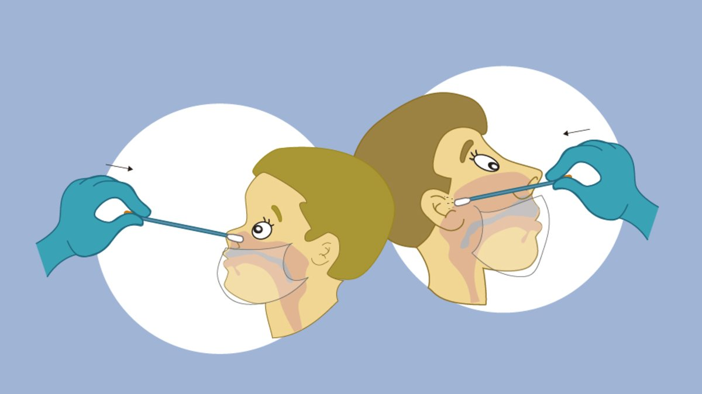

# PRÁCTICA DE MODELADO
# 1 INTRODUCCIÓN
A finales de diciembre de 2019 se identificaron en Wuhan, en la provincia china de Hubei, 41 casos de neumonía. Un análisis más exhaustivo mostró que se trataba de un nuevo caso de coronavirus que fue denominado SARS-CoV-2, o como comúnmente se conoce, Covid-19.

Cuando se detectaron los primeros casos, nadie podía imaginar que, unos meses más tarde, concretamente el 11 de marzo de 2020, la Organización Mundial de la Salud (OMS) declararía que el nuevo brote de coronavirus constituía una pandemia debido a que esta nueva enfermedad ya estaba presente en los seis continentes del planeta.

Actualmente hay más de 50 millones de casos confirmados en todo el planeta (y más de un millón de muertos relacionados con esta enfermedad) por lo que los países han tenido que tomar diferentes medidas como los cierres de fronteras o el confinamiento de la población para intentar aplanar la curva de incidencia del virus y evitar su rápida propagación. 

Además, ahora que se van conociendo más detalles de esta nueva enfermedad: cómo se propaga, cómo podemos reducir el número de contagios, síntomas relacionados, etc., están surgiendo diferentes sistemas software, como Radar Covid, para rastrear y gestionar la información de los ciudadanos con el fin de aplanar la curva de incidencia e intentar erradicar esta pandemia o posibles pandemias que surjan en el futuro. 

Sin embargo, ninguna de las aplicaciones actuales está teniendo los resultados que se esperaban ya que ninguna es obligatoria o se basan en software que no toda la población conoce, y por este motivo nace la aplicación de Pandemio.

Pandemio será una plataforma que permitirá rastrear y gestionar la información de los ciudadanos de la próxima pandemia con el fin de reducir el impacto de la pandemia en la población y así evitar tomar decisiones extremas como el confinamiento domiciliario de la población.

En este documento se especifican los aspectos más destacados de Pandemio, confiando en que sirvan como punto de partida para llevar a cabo un análisis detallado de los requisitos de este proyecto. Esta especificación de requisitos debe ser suficientemente precisa como para afrontar, en fases posteriores, el diseño y la implementación del proyecto.

 

### 1.1 Alcance
Dado que lo que se busca con esta aplicación es el control total sobre el contagio y expansión de la pandemia, se buscará alcanzar al máximo de la población posible, en este caso el 100% de las personas que utilizan dispositivos móviles.

Deberemos para ello crear una nueva aplicación móvil que llamaremos Pandemio y llevar a cabo un proceso judicial con el objetivo de que Pandemio sea instalada en todos los dispositivos móviles de forma obligatoria, ya sea a través de Google en los Android, o de Apple en dispositivos iOS.

Una vez tengamos la certeza de que la aplicación está instalada en todos los dispositivos móviles, el objetivo es controlar a las personas diagnosticadas como positivas en la próxima pandemia y a las personas a las que hayan podido contagiar, usando para ello la ubicación del teléfono, o en su defecto, por medio de una triangulación a través de las antenas de telefonía móvil siempre que se pueda obtener un margen de error pequeño a la hora de ubicar a las personas. En cualquier caso, se descarta el uso del Bluetooth por todos los inconvenientes que genera en las aplicaciones móviles que existen actualmente.

Por otro lado, habrá que considerar la posibilidad de que un caso positivo en la próxima pandemia o un contacto estrecho se desplace entre comunidades autónomas o incluso a otros países. La aplicación tendrá bases de datos independientes para cada comunidad autónoma ya que la gestión de la sanidad en cada una de ellas es diferente, por lo que en caso de que se produzca un desplazamiento de este tipo se deberá advertir a los sistemas sanitarios de aquellos lugares a los que se ha desplazado el caso positivo. En caso de permanecer en España podremos seguir su movimiento a través de Pandemio, pero en caso de salir a otro país se avisará a las autoridades sanitarias del país correspondiente y pasaría a ser de su responsabilidad.

Desde Pandemio se crearán citas médicas automáticas para que los contactos estrechos de un caso positivo acudan a realizarse las pruebas médicas oportunas, y en caso de que no acudan, se informará a las fuerzas del orden (policía local, nacional, guardia civil o al ejército) para que vayan a investigar el motivo. Además, desde Pandemio se tratará de controlar si un caso positivo está cumpliendo o no la cuarentena.

Surge también el problema en cuanto al rastreo de personas que no utilizan dispositivos móviles. Tenemos que aceptar este hecho, intentando tener cierto seguimiento a través de sus familiares o personas cercanas, por lo que se incluirá la posibilidad de informar de un caso positivo/sospechoso por si una persona tiene a su cargo a otra que no dispone de dispositivo móvil. Esto supone que el personal sanitario y las fuerzas del orden deberán tener un mayor control sobre este grupo de población. 

Siendo conscientes de que el rastreo de la ubicación y los movimientos de la población puede verse como una invasión a su intimidad, nos comprometemos a respetar en todo momento la Ley de Protección de Datos y a almacenar los datos de cada usuario solo el tiempo que sea necesario para el rastreo de la enfermedad. A los datos sanitarios solo tendrán acceso el personal sanitario y las fuerzas del orden, mientras que los usuarios de Pandemio solo podrán ver un mapa de calor con las zonas por las que se ha movido una persona con diagnóstico positivo, pero siempre respetando el anonimato y la confidencialidad de los usuarios de la aplicación.

En cuanto al mantenimiento y actualizaciones de la aplicación, el objetivo inicial es obtener un producto final por lo que no serían necesarias, aunque Pandemio estaría abierto a versiones y actualizaciones en caso de necesidad.

A continuación mostramos el árbol de características con las primeras funcionalidades que se esperan de Pandemio tras la primera entrevista y que iremos completando a medida que avance el proyecto.

1. Localización
	1.1. Localizacion GPS
		1.1.1. Activar
		1.1.2. Desactivar
		1.1.3. Guardar historial
		1.1.4. Enviar datos mapa calor
	1.2 Triangulación antenas moviles
		1.2.1. Comprobar intensidad señal
		1.2.2. Guardar historial
		1.2.3. Enviar datos mapa calor
	
2. Notificación
	2.1. Cita médica
		2.1.1. Mostrar aviso
		2.1.2. Avisar fuerzas del orden
		2.1.3. Confirmar positivo
		2.1.4. Establecer cuarentena
	2.2. Cuarentena
		2.2.1. Mostrar aviso
		2.2.2. Comprobar cuarentena
		2.2.3. Avisar fuerzas del orden 
		
3. Formulario
	3.1. Caso positivo
		3.1.1. Solicitar formulario
		3.1.2. Verificar formulario
		3.1.3. Enviar formulario
	3.2. Caso sospechoso
		3.2.1. Solicitar cita médica
		3.2.2. Verificar cita médica
	
4. Mapa de calor
	4.1. Dibujar
	4.2. Visualizar
	4.3. Actualizar
		
5. Info adicional y ajustes
	5.1. Cambiar idioma/dialecto
		5.1.1. Seleccionar español
		5.1.2. Seleccionar inglés
		5.1.3. Seleccionar catalán
		5.1.4. Seleccionar gallego
		5.1.5. Seleccionar valenciano
		5.1.6. Seleccionar euskera
	
	5.2. Compartir casos positivos 
		5.2.1. Entre CCAA
		5.2.2. A países

 

### 1.2 Objetivos
En la siguiente tabla se describen los principales objetivos que se esperan alcanzar de Pandemio cuando se termine de implementar:
 | ID | OBJETIVO |
 | :--: | :----- |
 | **OB_01** | Mejorar las aplicaciones existentes en la lucha contra una futura pandemia. |
 | **OB_02** | Alcanzar el 100% de la población que disponga de dispositivos móviles. |
 | **OB_03** | Alcanzar el mayor número de población posible. |
 | **OB_04** | Rastrear y gestionar la información de los usuarios de forma anónima. |
 | **OB_05** | Preservar la privacidad de los usuarios. |
 | **OB_06** | Reducir el impacto de futuras pandemias en la sociedad. |
 | **OB_07** | Automatizar el proceso de citaciones para realizar pruebas médicas. |
 | **OB_08** | Informar a los usuarios que deben acudir a realizarse pruebas médicas. |
 | **OB_09** | Avisar a las fuerzas del orden si un usuario no acude a realizarse las pruebas médicas. |
 | **OB_10** | Avisar a las fuerzas del orden si un usuario no cumple con la cuarentena que se le ha impuesto. |
 | **OB_11** | Coordinar los diferentes servicios sanitarios y autoritarios de las distintas comunidades autónomas. |
 | **OB_12** | Verificar que los usuarios cumplen las cuarentenas que deban hacer. |
 | **OB_13** | Rastrear a los contactos estrechos de los usuarios. |
 | **OB_14** | Mostrar un mapa de calor con las zonas de movilidad de los casos positivos. |

 
 

## 2 INFORMACIÓN DEL DOMINIO DEL PROBLEMA
Desde comienzos del año 2020 el mundo se encuentra sumergido en una pandemia global debido al coronavirus COVID-19. Actualmente, en España, como modo de rastreo del virus y como ayuda a los ciudadanos, se han creado diferentes sistemas software para intentar reducir el impacto que está provocando esta pandemia, pero sin los resultados que se esperaban.

Pandemio tratará de mejorar los sistemas existentes para que en una futura pandemia estemos más preparados para combatirla, para que el alcance de reproducción de la enfermedad disminuya (y con ello el número de contagios y muertes provocadas por ella) y no sea necesario tomar medidas extremas como el confinamiento domiciliario de todo el país lo que supondría un desastre económico y el empobrecimiento de la población.

 

### 2.1 Introducción al Dominio del Problema
Para la pandemia en la que nos encontramos, cuando una persona comienza a presentar síntomas de la enfermedad o ha estado en contacto con una persona diagnosticada como positiva, debe permanecer en cuarentena y acudir al centro de salud para realizarse pruebas médicas. Estas pruebas consisten en realizarse un test rápido (que en caso de dar positivo se confirma que la persona presenta el coronavirus) y/o una PCR para confirmar los resultados obtenidos por el test rápido si se ha obtenido un negativo o no se lo ha realizado por algún motivo. Además, aunque se obtenga una PCR negativa, es necesario realizar una cuarentena de unos 10 días para evitar posibles falsos negativos. A los 10 días se realiza una nueva PCR para poder dar el alta médica a esa persona.

En la actualidad todo este proceso de citación y rastreo de personas se realiza de forma manual, en cambio, con Pandemio se tratará de automatizar todo el proceso. Además, el cumplimiento de la cuarentena no se puede verificar por ningún medio efectivo que no conlleve un gran gasto de tiempo por parte del personal sanitario o de los cuerpos de policía, por lo que Pandemio se intentará automatizar en los casos que sea posible (con huella dactilar o por reconocimiento facial con el dispositivo móvil, enviando ubicación a horas aleatorias, etc.).

 

### 2.2 Glosario de términos

A continuación, se presenta una lista ordenada alfabéticamente con los principales términos, acrónimos y abreviaturas específicos del dominio del problema.

* **Aplanar la curva de incidencia:** El objetivo para luchar contra una enfermedad es reducir el número de contagiados. La curva de la gráfica de contagio se aplana cuando deja de crecer el número de contagiados y se dibuja algo así como una 'meseta'. Es la forma gráfica de ver que, durante un periodo de tiempo, el número de contagios se mantiene y no se incrementa, lo que significa que la velocidad de los contagios es menor y, por tanto, que se ha frenado la tendencia al alza. El aislamiento sanitario, las pruebas médicas y las medidas sanitarias que se toman tienen como intención aplanar la curva de contagios.

* **Bluetooth:** Especificación industrial para redes inalámbricas de área personal (WPAN) creado por Bluetooth Special Interest Group, Inc. que posibilita la transmisión de voz y datos entre diferentes dispositivos mediante un enlace por radiofrecuencia en la banda ISM de los 2.4 GHz. Los principales objetivos que se pretenden conseguir con esta norma son:
  - Facilitar las comunicaciones entre equipos móviles.
  - Eliminar los cables y conectores entre estos. 
  - Ofrecer la posibilidad de crear pequeñas redes inalámbricas y facilitar la sincronización de datos entre equipos personales.
  
* **Caso sospechoso:** Se considerará a una persona caso sospechoso cuando presente los síntomas habituales y más característicos asociados a la enfermedad.
  
* **Caso sospechoso (COVID-19):** Cuadro clínico de infección respiratoria aguda de aparición súbita de cualquier gravedad que cursa, entre otros, con fiebre, tos o sensación de falta de aire, y que pueden estar asociados o no a síntomas graves como dificultad respiratoria o neumonía. Otros síntomas atípicos como la odinofagia (dolor de garganta al ingerir), anosmia (pérdida de olfato), ageusia (pérdida de gusto), dolores musculares, diarreas, dolor torácico o cefaleas, entre otros, pueden ser también considerados como síntomas de sospecha de infección de Covid-19.

* **Contacto estrecho:** Persona que haya tenido una exposición a la enfermedad de forma que las posibilidades de contagio sean altas y por tanto se le deban hacer las pruebas pertinentes y mantener bajo observación.

* **Contacto estrecho (COVID-19):** Persona que haya coincidido con un caso diagnosticado como COVID positivo, permaneciendo a menos de 2 metros, durante más de 15 minutos, sin mascarilla y durante las 48 horas previas a la fecha del diagnóstico. Si todas las personas usaron mascarillas en todo momento, se mantuvo la distancia de seguridad y el espacio estuvo ventilado no se considerarían contactos estrechos. 

* **Contagio:** Transmisión de una enfermedad por contacto con el agente patógeno que la causa. (El coronavirus tiene un alcance de reproducción de 2,68 según la revista científica Lancet. Es decir, cada persona contagiada llega a contagiar a 2,68 personas, un índice relativamente alto, lo que ha facilitado su expansión por el mundo.)

* **Coronavirus:** Gran familia de virus que pueden provocar enfermedades tanto a animales como a humanos. Se sabe que, en los humanos, todos los virus de esta familia pueden causar infecciones respiratorias, que pueden ir desde un resfriado normal a una enfermedad grave, como son la SRAS, la MERS o el Covid-19. La primera vez que se habló de este tipo de virus fue en la revista Nature el 16 de noviembre de 1968. Los investigadores lo llamaron 'coronavirus' porque la forma del virus al microscopio era como similar al de la corona solar como podemos observar en la imagen.

* **COVID-19:** Enfermedad infecciosa causada por el coronavirus SARS-CoV-2 y que se ha descubierto recientemente. El origen léxico del Covid-19 proviene de 'co', en alusión a la forma de corona solar del virus, 'vi' que corresponde a la palabra virus y 'd' que hace referencia a enfermedad ("disease" en inglés). Finalmente se le puso el número 19 por el año en que se detectó en seres humanos.

* **Cuarentena:** Se trata de un aislamiento preventivo durante un tiempo determinado con el objetivo de evitar el contagio de ciertas enfermedades. Lo llevan a cabo personas que están en su domicilio porque poseen confirmación médica de haber contraído una enfermedad o porque están esperando un diagnóstico definitivo (en el caso del Covid-19, a la espera de PCR/test rápido por ser un caso sospechoso o ser un contacto estrecho). No tienen por qué ser 40 días exactos. De hecho, para el caso del Covid-19 suele rondar los 10 días. 

* **Estado de alarma:** En España se declara en todo el país (o en parte de este) mediante un decreto del consejo de ministros en el caso de calamidades, desgracias públicas como inundaciones, terremotos o crisis sanitarias como la que vivimos por culpa del coronavirus. Esta disposición permite limitar la libre circulación de las personas, intervenir industrias, requisar temporalmente bienes, y limitar o racionar los servicios o el consumo de artículos de primera necesidad. Además, permitiría realizar los cambios legales que fueran necesarios para poder obtener los datos de localización de los dispositivos móviles que poseen las diferentes operadoras, e incluso de los fabricantes de teléfonos y sistemas operativos (Google, Apple, etc.).

* **Incubación:** Se trata del tiempo comprendido entre la exposición a un organismo patogénico y el momento en que los síntomas aparecen por primera vez. En el caso del coronavirus, el tiempo de incubación es de 5,4 días de media, aunque se han observado casos en que el periodo de incubación es de hasta 14 días.

* **Organización Mundial de la Salud (OMS):** Organismo especializado de las Naciones Unidas creado en 1946 con el propósito fundamental de alcanzar para todos los pueblos el grado más alto posible de salud. Coordina programas encaminados a solucionar problemas sanitarios y se ocupa de la inmunización, la educación sanitaria y el suministro de medicamentos esenciales.

* **Pandemia:** Tal y como establece la OMS, se llama pandemia a la propagación a gran velocidad y a escala mundial de una nueva enfermedad. Lo que la diferencia de la epidemia es el grado en que aumentan los casos y su alcance internacional. La OMS declaró al Covid-19 como pandemia el 11 de marzo de 2020 cuando se extendió por los seis continentes y se certificaron contagios en más de 100 países de todo el planeta.

* **PCR:** La reacción en cadena de la polimerasa, conocida como PCR por sus siglas en inglés (polymerase chain reaction), es una técnica de la biología molecular desarrollada en 1986 por Kary Mullis. Su objetivo es obtener un gran número de copias de un fragmento de ADN particular, partiendo de un mínimo; en teoría basta partir de una sola copia de ese fragmento original, o molde. En algunos casos, como en la actual epidemia de coronavirus SARS-CoV-2, se están empleando las PCR para detectar, confirmar o descartar la presencia del coronavirus en el organismo ya que esta prueba de diagnóstico permite localizar y amplificar un fragmento del material genético de un patógeno o microorganismo, que en el caso del coronavirus es una molécula de ARN. El Ministerio de Sanidad subraya en el documento de Estrategia de detección precoz, vigilancia y control del Covid-19 que las muestras recomendadas para la PCR son del tracto respiratorio superior e inferior:
  - Superior: exudado preferiblemente nasofaríngeo y orofaríngeo o exudado nasofaríngeo. 
  - Inferior: preferiblemente lavado broncoalveolar, broncoaspirado, esputo (si es posible) y/o aspirado endotraqueal, especialmente en pacientes con enfermedad respiratoria grave. 
  
  Así, la toma de la muestra se obtiene inclinando ligeramente la cabeza del paciente hacia atrás, se introduce un hisopo o bastoncillo en la garganta, hasta la faringe, y se rota o da vueltas de cinco a 10 segundos, aunque también se puede tomar la muestra del interior de la nariz, por lo que se introduce el bastoncillo por un orificio nasal unos cinco o siete centímetros hasta la nasofaringe y se gira durante unos segundos para obtener el tejido necesario.
  
  En el siguiente enlace se puede ver cómo se debe realizar una PCR: [Link](https://www.youtube.com/watch?v=Yf-HDkJGW08 "¿Cómo se realiza una prueba PCR?").

* **Test rápido:** Este nuevo test rápido de antígenos es una nueva prueba de la que disponemos que nos permite detectar el Covid-19 desde el mismo inicio del contacto con una altísima fiabilidad, muy similar a la que nos ofrecerá una PCR, pero con obtención de resultados en apenas 15 minutos. Los test rápidos se realizan con muestras de exudados de la nariz y del fondo de la garganta –que se toman con un bastoncillo o hisopo– y en ellos se detectan la posible presencia de antígenos, es decir, permiten detectar si hay presencia del virus SARS-CoV-2 en el paciente por medio de alguno de sus componentes, como por ejemplo, por sus proteínas.

 

> En la siguiente imagen podemos ver las principales diferencias entre la técnica de la PCR y los test rápidos en el diagnóstico del Covid-19:

  

  

  

* **Vacuna:** Se trata de una sustancia compuesta por microorganismos atenuados o muertos que se introduce para estimular la formación de anticuerpos y conseguir inmunidad frente a ciertas enfermedades. Hasta la fecha no existe ninguna vacuna ni medicamento antiviral específico para prevenir o tratar el COVID-19.

 
 

# 3 DESCRIPCIÓN DE LA SITUACIÓN ACTUAL 
Aunque la aplicación Radar Covid no nació en España, el Gobierno de España decidió comenzar a utilizar esta aplicación a nivel nacional como parte de las principales soluciones para frenar la pandemia ya que en otros países de la Unión Europea había tenido bastante éxito. Para usar Radar Covid en cada comunidad autónoma, cada una de ellas debía comunicar al Ministerio de Sanidad su uso, que tras comprobar que todo estaba en orden, pedía a la Secretaría de Estado de Inteligencia Artificial (dependiente del Ministerio de Asuntos Económicos y Transformación Digital) que comenzara la integración técnica. Para esta integración técnica, cada comunidad autónoma debía crear un protocolo propio dentro de sus sistemas sanitarios para enviar los códigos a los contagiados (que identifican anónimamente a los casos positivos y permiten informar a sus contactos estrechos sin desvelar la identidad de los casos positivos) y formar a los rastreadores para que pudieran utilizar de la mejor manera posible la información que reciben de la aplicación. Sin embargo, todo este proceso de puesta en marcha fue bastante lento ya que intervinieron gran cantidad de actores. 

Hoy en día, Radar Covid ya se está usando a nivel nacional pero no se están consiguiendo los resultados que se esperaban por diversos motivos como son:
  * El número de descargas de la aplicación es muy bajo ya que es una aplicación de uso voluntario y además se le ha dado poca publicidad en los medios nacionales.
  * El conocimiento de la tecnología médica en España es insuficiente a nivel de la población.
  * La dificultad para comunicar un positivo. Esto se debe a que los sanitarios deben proporcionar a los usuarios diagnosticados como positivos un código para insertar en la aplicación, y sin embargo muchos sanitarios desconocen la existencia de estos códigos. Además, la colaboración por parte de las Comunidades Autónomas no está siendo la adecuada, y surgen continuamente problemas en la generación de códigos ya que la gestión de los datos entre las diferentes comunidades no está estandarizada.
  * Está basada en el uso de Bluetooth, lo que la hace inservible si el Bluetooth está apagado o bien, ocupado con los auriculares u otra aplicación.
  
Por todo ello y más, nace Pandemio, que tratará de rastrear y gestionar la información de los ciudadanos de la próxima pandemia de una forma más eficaz y eficiente.
Para ello es necesario conocer en detalle la situación actual para evitar cometer los mismos errores de Radar Covid en Pandemio y mejorar lo que ya es positivo.

 

## 3.1 Pros y contras de la Situación Actual
En esta sección señalaremos los principales aspectos positivos y negativos de Radar Covid con el fin de conservar sus fortalezas, pero corregiendo las debilidades que la han llevado a fracasar para que no suceda lo mismo con Pandemio.

### 3.1.1 Fortalezas de la Situación Actual

Algunos de los aspectos positivos de Radar Covid que convendría que se mantuvieran en Pandemio son los siguientes:

| ID | NOMBRE | DESCRIPCIÓN |
| :-----: | :----- | :----- |
| **FO_01** | Anonimato | La aplicación funciona sin revelar la identidad del usuario ni la del dispositivo móvil. Además, no registra datos personales ni de geolocalización. |
| **FO_02** | Alertas rápidas | Rápido aviso al usuario de que ha estado en contacto con un positivo cercano para que comience la cuarentena cuanto antes y disminuya sus contactos sociales. |
| **FO_03** | Discreción | Las alertas de exposición se envían sin indicar el lugar ni momento concreto donde se produjo la exposición. |
| **FO_04** | Descentralización de los datos | Los datos de cada usuario solo se guardan en su dispositivo móvil. |
| **FO_05** | Encriptación de los datos | La conexión entre los dispositivos móviles y el servidor es privada. |
| **FO_06** | Interfaz amigable | Fácil uso de la interfaz. |
| **FO_07** | Sección de ayuda | Tiene sección de preguntas y enlaces de interés acerca de la enfermedad. |
| **FO_08** | Varios idiomas | Posibilidad de usar la aplicación en varios dialectos (catalán, euskera, gallego y valenciano) e idiomas (español e inglés). |
| **FO_09** | Gratuita | Es gratuita y fácilmente instalable. |
| **FO_10** | Anonimato | Es posible comunicar de forma anónima el diagnostico positivo de una prueba PCR o un test rápido. |
| **FO_11** | Consumo de datos nulo | No consume ningún dato de las tarifas telefónicas. |
| **FO_12** | Código abierto | El código fuente de la aplicación de rastreo está publicado en GitHub para que cualquier desarrollador externo pueda notificar errores y colaborar. |
 

### 3.1.2 Debilidades de la Situación Actual

Por el contrario, también hay que destacar los principales aspectos negativos de Radar Covid que consideramos que no deben repetirse en Pandemio:

| ID | NOMBRE | DESCRIPCIÓN |
| :---: | :----- | :----- |
| **DE_01** | Descarga y uso voluntario | La instalación y el uso de la aplicación no son obligatorios lo que dificulta el rastreo del virus en la población ya que solo un pequeño porcentaje de la población la usa diariamente. |
| **DE_02** | Sanitarios poco familiarizados con la App | No todo el personal sanitario está familiarizado con el funcionamiento de la aplicación y muy pocos hacen uso de ella. |
| **DE_03** | Desconocimiento de la App | Gran parte de la población no conoce la existencia de la aplicación. |
| **DE_04** | Vulnerabilidad a ataques | El uso del Bluetooth provoca que los dispositivos móviles sean más vulnerables a ataques informáticos. |
| **DE_05** | Funcionamiento basado en Bluetooth y GPS | La aplicación hace uso del Bluetooth para su correcto funcionamiento y generalmente suele estar apagado u ocupado por otros dispositivos. Esto provoca que las aplicaciones actuales no funcionen correctamente y que el rastreo del virus sea aún más complicado. Además, hay dispositivos móviles que aún no tienen buenos servicios de GPS incorporados. |
| **DE_06** | Incompatibilidad entre Apps | El uso del Bluetooth en varias aplicaciones puede generar problemas de incompatibilidad entre ellas y que los sistemas software no funcionen correctamente. |
| **DE_07** | Desconocimiento del Bluetooth | Mucha gente mayor no conoce cómo funciona el Bluetooth por lo que las aplicaciones que se basan en Bluetooth pierden su potencial. |
| **DE_08** | Desconocimiento del propio dispositivo móvil | Mucha gente de avanzada edad desconoce como usar los dispositivos móviles y como descargar aplicaciones. |
| **DE_09** | Nula estandarización | Las bases de datos de las diferentes administraciones no están estandarizadas lo que provoca que muchos usuarios no puedan informar de su resultado positivo si se mueven entre distintas comunidades. |

 

## 3.2	Modelos de Procesos de Negocio Actuales

En Radar Covid intervienen gran cantidad de actores que provocaron que su puesta en marcha fuera bastante lenta, pero que son necesarios para un correcto funcionamiento de la aplicación y que esta pueda combatir al Covid de forma efectiva. Aunque el número de actores es elevado, los procesos que lleva a cabo la aplicación se pueden resumir en tres.

### 3.2.1 Descripción de los Actores de Negocio Actuales

Los principales actores de negocio que intervienen en la actualidad en Radar Covid son los siguientes: 

| **ID** | **Nombre** | **Descripción** |
| :---: | :--- | :--- |
| **AC_01** | Gobierno de España | Es el órgano que decidió que Radar Covid se comenzará a utilizar en España y el encargado de permitir e impulsar su uso. |
| **AC_02** | Secretaría de Estado de Digitalización e Inteligencia Artificial del Gobierno de España | Esta secretaría, dependiente del Ministerio de Asuntos Económicos y Transformación Digital, es la encargada de personalizar la aplicación de Radar Covid para España (recordemos que es una aplicación que se usa en toda Europa) e integrarla en los servicios sanitarios de cada comunidad autónoma. Además, es la encargada de impulsar la aplicación en España y subsanar cualquier brecha de seguridad que pudiera surgir. |
| **AC_03** | Sanidad de cada CCAA | Actualmente la Sanidad de España está transferida, por lo que cada comunidad autónoma debe decidir sus protocolos a seguir. Se encarga de crear los protocolos de Radar Covid dentro de cada comunidad autónoma, de formar a los sanitarios y a los rastreadores, y comunicarse con otras comunidades autónomas cuando existen casos que se mueven entre distintas comunidades autónomas. |
| **AC_04** | Sanitarios y rastreadores | Son los encargados de generar los códigos para los ciudadanos que hayan obtenido un resultado positivo ya que los usuarios que usan la aplicación no los pueden generar por sí mismos. Además, son los encargados de rastrear el virus y los posibles contactos estrechos que hayan mantenido los ciudadanos con un diagnóstico positivo. |
| **AC_05** | Usuario final | Debido a que Radar Covid es una aplicación de uso voluntario, es necesario que los ciudadanos se descarguen esta aplicación y la usen correctamente. Deben usar el Bluetooth y el GPS, y son los encargados de comunicar su positivo a través de la aplicación cuando han obtenido un diagnóstico médico positivo. |

### 3.2.2 Descripción de Procesos de Negocio Actuales

La aplicación Radar Covid es muy sencilla y los procesos que lleva a cabo se pueden resumir en los siguientes:

| **PR_01** | **Almacenar identificadores** |
| :---: | :--- |
| **Descripción** | Cuando dos usuarios que tienen Radar Covid activado se encuentran, si permanecen durante un tiempo juntos (más de 15 minutos), sus dispositivos móviles intercambian los números identificadores de la aplicación y los almacenan localmente en sus registros de contacto para tener un registro de las personas que hayan estado cerca de los usuarios en los últimos días. |

En el siguiente diagrama de actividad podemos ver un resumen de este proceso:

 

| **PR_02** | **Generar código** |
| :---: | :--- |
| **Descripción** | Después de que un usuario haya acudido a realizarse una prueba médica, los sanitarios comprueban el resultado. Si el resultado de la prueba es positivo, tienen que solicitar al sistema un código que el usuario podrá introducir voluntariamente en la aplicación. |

En el siguiente diagrama de actividad podemos ver un resumen de este proceso:

 

| **PR_03** | **Generar notificación** |
| :---: | :--- |
| **Descripción** | Continuamente la aplicación recopila automáticamente informes del servidor que contienen números que identifican de forma anónima a los casos positivos (estos informes se generan cuando un usuario comunica su positivo en la aplicación por medio del código que le proporciona un sanitario). Cuando la aplicación descarga estos informes, comprueba si algún identificador se encuentra entre sus registros de contacto locales. Si encuentra alguna coincidencia, entonces el usuario ha estado en contacto cercano con un paciente positivo, y la aplicación muestra una notificación. |

En el siguiente diagrama de actividad podemos ver un resumen de este proceso:

 
 

## 3.3 ENTORNO TECNOLÓGICO ACTUAL

Radar Covid es una aplicación de código abierto que podemos encontrar en el siguiente link: [https://github.com/RadarCOVID](https://github.com/RadarCOVID) y utiliza el protocolo abierto 'Decentralized Privacy-Preserving Proximity Tracing' (DP-3T, estilizado como dp3t), que fue desarrollado en respuesta a la pandemia Covid-19 para facilitar el rastreo de contactos digitales de los participantes infectados. 

Cuando dos usuarios que tienen Radar Covid activado se encuentran, si permanecen juntos durante un tiempo superior a 15 minutos, sus dispositivos móviles intercambian los números identificadores de la aplicación y los almacenan localmente en sus registros de contacto. 

Cuando uno de ellos obtiene un resultado positivo en un análisis médico, si introduce un código en la aplicación (este código se lo proporcionan los sanitarios), se envía un informe a un servidor central informando de su caso de manera anónima. 

Continuamente la aplicación recopila los informes del servidor de forma automática y comprueba si algún identificador contenido en el informe del servidor se encuentra entre sus registros de contacto locales. Si encuentra alguna coincidencia, entonces el usuario ha estado en contacto cercano con un paciente diagnosticadp como positivo, y es advertido por la aplicación. Puesto que cada dispositivo verifica localmente los registros de contacto, y por lo tanto los registros de contacto nunca se transmiten a terceros, el servidor de informes central no puede por sí mismo determinar la identidad o el registro de contacto de cualquier usuario de la aplicación.

El protocolo de enlace del dispositivo utiliza Bluetooth Low Energy para encontrar e intercambiar detalles entre los usuarios de la aplicación que se encuentren en un rango cercano, y la fase de notificación de infecciones utiliza HTTPS para cargar el informe en un servidor central de Amazon Web Services.

Finalmente, el código fuente de la aplicación está escrito en su mayoría en Kotlin (lenguaje de programación con tipo estático desarrollado por JetBrains y que se utiliza con mayor frecuencia para complementar o reemplazar Java en aplicaciones empresariales y de usuario final) y XML para la parte de cliente, y Java para la parte de servidor, y utiliza SQL para realizar las búsquedas en las bases de datos. 

### 3.3.1 Descripción del Entorno de Hardware Actual

El entorno hardware de Radar Covid consiste en los dispositivos móviles de cada usuario, en los servidores de Amazon Web Services y en los ordenadores de los centros de salud y hospitales que generan los códigos que los contactos positivos pueden introducir voluntariamente en la aplicación.

Además, también podemos destacar los ordenadores del Gobierno de España, concretamente los de la Secretaría de Estado de Inteligencia Artificial, encargados del mantenimiento y buen funcionamiento de la aplicación en todo momento. 

### 3.3.2 Descripción del Entorno de Software Actual

El entorno software de Radar Covid es bastante simple a nivel de usuario final ya que se trata de una aplicación móvil disponible en Android e iOS y para su correcto funcionamiento solo es necesario el uso del Bluetooth y del GPS. 

La gestión de los datos está basada en el modelo descentralizado ya que los datos de cada usuario se guardan en cada dispositivo móvil. Los pocos datos que se comparten con la aplicación están alojados en los servidores de Amazon Web Services y la subida de datos al servidor se hace con un software de la compañía estadounidense de forma cifrada y anónima para guardar la confidencialidad y el anonimato de los usuarios de la aplicación.

Finalmente también es necesario un programa generador de códigos que utiliza el personal sanitario cuando un ciudadano obtiene un resultado positivo en un test rápido o en una PCR. Este código generado es el que se le da al ciudadano para que lo registre voluntariamente en su aplicación de Radar Covid y se avise a todas las personas que hayan estado más de 15 minutos con él.
