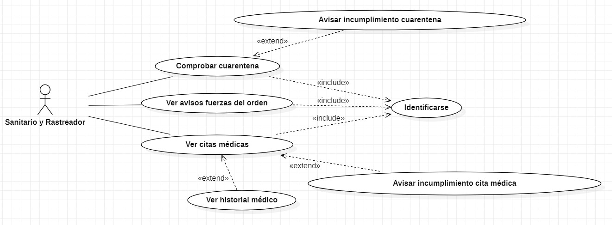
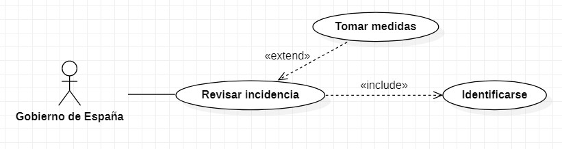
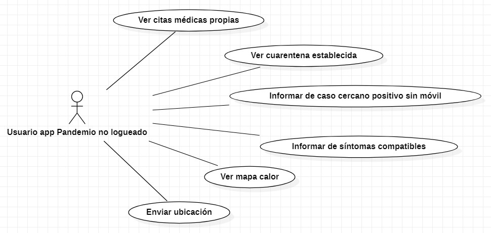

<h1 align="center">
   PRÁCTICA DE MODELADO: PANDEMIO
</h1>

# ÍNDICE
6. CATÁLOGO DE REQUISITOS DEL SISTEMA A DESARROLLAR.
   1. Requisitos Generales del Sistema.
   2. Casos de uso del Sistema.
       1. Diagramas de Casos de Uso del Sistema.
       2. Especificación de Actores del Sistema.
       3. Especificación de Casos de Uso del Sistema.
   3. Requisitos Funcionales del Sistema.
       1. Requisitos de Información del Sistema.
       2. Requisitos de Reglas de Negocio del Sistema.
       3. Requisitos de Conducta del Sistema.
   4. Requisitos No Funcionales del Sistema.
       1. Requisitos de Fiabilidad.
       2. Requisitos de Usabilidad.
       3. Requisitos de Eficiencia.
       4. Requisitos de Mantenibilidad.
       5.	Requisitos de Portabilidad.
       6.	Requisitos de Seguridad.
       7.	Otros Requisitos No Funcionales.
   5. Restricciones Técnicas del Sistema.
   6.	Requisitos de Integración del Sistema.
   7.	Información Sobre Trazabilidad.

 

# 6 CATÁLOGO DE REQUISITOS DEL SISTEMA A DESARROLLAR

## 6.1 Requisitos Generales del Sistema
Esta sección debería contener la especificación de los requisitos generales del sistema, también denominados características del sistema (system features) u objetivos del sistema. Sin embargo, ya que en clase no hemos diferenciado los objetivos del sistema de los objetivos de negocio, no entraremos en más detalle en esta sección y para cualquier referencia a los objetivos deberemos acudir al apartado "4.1 Objetivos de Negocio" donde ya se especificaron todos los objetivos y subobjetivos de Pandemio.

 

## 6.2 Casos de uso del Sistema 
Los casos de uso describen cómo utilizarán el sistema a desarrollar los futuros usuarios de Pandemio para realizar sus procesos de negocio. Esta sección se divide en las secciones que se describen a continuación:

### 6.2.1 Diagramas de Casos de Uso del Sistema
Los principales casos de uso que realizarán los futuros usuarios de Pandemio son los siguientes:

> Casos de uso de los sanitarios y rastreadores:

  

> Casos de uso de las fuerzas del orden:

  

> Casos de uso del Gobierno de España:

  

> Casos de uso de los usuarios no identificados:

  

### 6.2.2 Especificación de Actores del Sistema
Todas las especificaciones de los actores que se han identificado en los casos de uso las encontramos en el apartado "4.2.1 Descripción de los Actores de Negocio a Implantar", por lo que no entraremos en más detalle en esta sección. 

### 6.2.3 Especificación de Casos de Uso del Sistema
A continuación, se especifican todos los casos de uso que se han identificado en el apartado "6.2.1 Diagramas de Casos de Uso del Sistema":

| CU_01 | Comprobar cuarentena |
| :--: | :----- |
|**Precondición**| Una persona debe permanecer en cuarentena y se le asigna a un sanitario su seguimiento. Además, el sanitario/rastreador debe estar logueado en la aplicación. |
|**Descripción**| Un sanitario/rastreador puede ver las personas que deben realizar cuarentena y comprobar que la están realizando. |
|**Secuencia Normal**| 1. El sanitario abre la aplicación.   2. El sanitario elige la opción “Comprobar cuarentena”.   3. La aplicación muestra una lista de personas en cuarentena.   4. El sanitario busca en la lista a una persona.   5. El sanitario entra a ver los detalles de esa persona.   6. El sanitario solicita a esa persona que verifique su ubicación actual (CU_11).   7. El sistema muestra la ubicación que ha enviado la persona.   8. El sanitario comprueba la ubicación para verificar que la persona está cumpliendo la cuarentena. |
|**Postcondición**| La persona ha verificado su ubicación actual y queda reflejado en el sistema. |
|**Excepciones**| 3a. Si el sanitario no tiene ningún paciente en cuarentena se muestra una lista vacía.   6a. La persona no verifica su ubicación actual.   &nbsp;&nbsp;&nbsp; 6a.1. El sanitario escoge la opción "Avisar incumplimiento cuarentena".   &nbsp;&nbsp;&nbsp; 6a.2.El sanitario añade comentarios si es necesario.   &nbsp;&nbsp;&nbsp; 6a.3. El sanitario envía el aviso a las fuerzas del orden.   6b. La persona no dispone de teléfono móvil.   &nbsp;&nbsp;&nbsp; 6b.1. El sanitario escoge la opción "Avisar incumplimiento cuarentena".   &nbsp;&nbsp;&nbsp; 6b.2.El sanitario añade un comentario explicando que la persona no dispone de teléfono móvil.   &nbsp;&nbsp;&nbsp; 6b.3. El sanitario envía el aviso a las fuerzas del orden.   8a. La persona verifica su ubicación actual pero no está cumpliendo la cuarentena impuesta.   &nbsp;&nbsp;&nbsp; 8a.1. El sanitario escoge la opción "Avisar incumplimiento cuarentena".   &nbsp;&nbsp;&nbsp; 8a.2.El sanitario añade comentarios si es necesario.   &nbsp;&nbsp;&nbsp; 6b.3. El sanitario envía el aviso a las fuerzas del orden. |
|**Importancia**| Alta. |
|**Prioridad**| Alta. |

| CU_02 | Ver avisos fuerzas del orden |
| :--: | :----- |
|**Precondición**| El sanitario ha avisado previamente a las fuerzas del orden para informarles de un caso que no está cumpliendo la cuarentena o no ha asistido a una cita médica. Además, el sanitario debe estar logueado en la aplicación. |
|**Descripción**| Un sanitario/rastreador puede ver los avisos que han emitido las fuerzas del orden sobre un caso que ha abierto ese sanitario previamente. |
|**Secuencia Normal**| 1. El sanitario abre la aplicación.   2. El sanitario elige la opción “Ver avisos fuerzas del orden”.   3. La aplicación muestra todos los avisos que hayan emitido las fuerzas del orden sobre casos abiertos previamente por el sanitario.   4. El sanitario abre un aviso para ver los detalles y las nuevas noticias sobre el caso. |
|**Postcondición**| El sanitario visualiza los detalles de uno de los casos que tiene abiertos. |
|**Excepciones**| 3a. Si el sanitario no tiene ningún caso abierto se muestra una lista vacía.  |
|**Importancia**| Media. |
|**Prioridad**| Media. |

| CU_03 | Ver citas médicas |
| :--: | :----- |
|**Precondición**| El sanitario debe estar previamente logueado y tiene citas médicas fijadas con pacientes.  |
|**Descripción**| Un sanitario/rastreador puede ver la fecha, hora e historial médico del paciente de las citas que tiene programadas. |
|**Secuencia Normal**| 1. El sanitario abre la aplicación.   2. El sanitario elige la opción “Ver citas médicas”.   3. La aplicación muestra fecha, hora y nombre de los pacientes con citas programadas.    4. Un paciente acude a su cita médica.    5. El sanitario entra a ver los detalles de ese paciente.   6. El sanitario actualiza el historial médico del paciente. |
|**Postcondición**| El sanitario visualiza la agenda de citas programadas y actualiza cada una de ellas. |
|**Excepciones**| 3a. Si el sanitario no tiene ninguna cita programada se muestra una lista vacía.    4a. El paciente no acude a la cita médica que tiene programada.   &nbsp;&nbsp;&nbsp; 4a.1. El sanitario escoge la opción "Avisar incumplimiento cita médica".   &nbsp;&nbsp;&nbsp; 4a.2.El sanitario añade comentarios si es necesario.   &nbsp;&nbsp;&nbsp; 4a.3. El sanitario envía el aviso a las fuerzas del orden. |
|**Importancia**| Alta. |
|**Prioridad**| Alta. |

| CU_04 | Ver avisos |
| :--: | :----- |
|**Precondición**| El usuario de las fuerzas del orden debe estar logueado. |
|**Descripción**| El usuario de las fuerzas del orden accede a una lista con los avisos de los sanitarios sobre personas que o bien no cumplen cuarentena o bien no han acudido a su cita médica. |
|**Secuencia Normal**| 1. El usuario de las fuerzas del orden abre la aplicación.   2. Elige la opción “Ver avisos”.   3. La aplicación muestra todos los avisos que hayan emitido los sanitarios.   4. El usuario de las fuerzas del orden abre un caso   5.El usuario de las fuerzas del orden investiga el caso.   6. El usuario de las fuerzas del orden actualiza el caso.   7. El usuario de las fuerzas del orden cierra el caso. |
|**Postcondición**| El usuario de las fuerzas del orden visualiza los avisos realizados por los sanitarios y los actualiza. |
|**Excepciones**| 3a. Si no hubiera ningún aviso sanitario se muestra una lista vacía.  |
|**Importancia**| Alta. |
|**Prioridad**| Alta. |

| CU_05 | Revisar incidencia |
| :--: | :----- |
|**Precondición**| Es necesario estar logueado en la aplicación. |
|**Descripción**| El Gobierno de España puede ver estadísticas generales y por zonas, además de un mapa de calor, para ver qué zonas están más afectadas y tomar las medidas necesarias en función de esos datos. |
|**Secuencia Normal**| 1. El Gobierno abre la aplicación.   2. Elige la opción “Revisar incidencia”.   3. La aplicación muestra estadísticas generales y de las zonas más afectadas.  |
|**Postcondición**| En función de los datos obtenidos, se toman las medidas necesarias para reducir el impacto de la nueva pandemia en la población. |
|**Excepciones**| Ninguna. |
|**Importancia**| Alta. |
|**Prioridad**| Media. |

| CU_06 | Ver citas médicas propias |
| :--: | :----- |
|**Precondición**| Un usuario está pendiente de acudir a una cita médica. |
|**Descripción**| Un usuario de la aplicación de Pandemio puede ver la fecha, hora y lugar de la cita médica que tiene asignada. |
|**Secuencia Normal**| 1. El usuario abre la aplicación.   2. El usuario elige la opción “Ver citas médicas propias”.   3. La aplicación muestra la fecha, hora y lugar donde debe acudir a la cita médica. |
|**Postcondición**| El usuario ve la fecha, hora y lugar de la cita médica que tiene asignada. |
|**Excepciones**| 3a. Si el usuario no tiene que cumplir ninguna cita médica asignada se muestra un mensaje avisándole.    3b. Si el usuario ha informado de un caso cercano positivo sin móvil, el sistema especificará en el aviso quién debe acudir a la cita médica. |
|**Importancia**| Alta. |
|**Prioridad**| Alta. |

| CU_07 | Ver cuarentena establecida |
| :--: | :----- |
|**Precondición**| Un usuario está pendiente de realizarse pruebas médicas o se le ha establecido una cuarentena sanitaria. |
|**Descripción**| Un usuario de la aplicación de Pandemio puede ver cuantos días de cuarentena tiene que realizar. |
|**Secuencia Normal**| 1. El usuario abre la aplicación.   2. El usuario elige la opción “Ver cuarentena establecida”.   3. La aplicación muestra el número de días que quedan de cuarentena y la fecha en la que termina. |
|**Postcondición**| El usuario ve el número de días que le quedan para cumplir la cuarentena. |
|**Excepciones**| 3a. Si el usuario no tiene que cumplir ninguna cuarentena se muestra un mensaje avisándole.    3b. Si el usuario ha informado de un caso cercano positivo sin móvil, el sistema especificará en el aviso quién debe cumplir la cuarentena establecida y hasta qué fecha. |
|**Importancia**| Alta. |
|**Prioridad**| Alta. |

| CU_08 | Informar de caso cercano positivo sin móvil |
| :--: | :----- |
|**Precondición**| Un usuario tiene a su cargo a una persona que no dispone de teléfono móvil. |
|**Descripción**| Un usuario de la aplicación de Pandemio puede informar de un caso positivo para una persona dependiente que no dispone de teléfono móvil. |
|**Secuencia Normal**| 1. El usuario abre la aplicación.   2. El usuario elige la opción “Informar de caso cercano positivo sin móvil”.   3. El usuario rellena los datos que pide la aplicación.   4. El usuario envía el formulario.   5. La aplicación comprueba que los datos introducidos son correctos.   6. La aplicación procesa el formulario y genera una cita médica.   7. La aplicación muestra un mensaje con la cita médica creada. |
|**Postcondición**| Se ha creado una cita médica que se puede ver en ese momento o después en la opción “Ver citas médicas propias” (CU_06). |
|**Excepciones**| 5a. El formulario está mal rellenado o contiene algún error.   &nbsp;&nbsp;&nbsp; 5a.1. La aplicación muestra un mensaje de error con el motivo del fallo.   &nbsp;&nbsp;&nbsp; 5a.2. Volver al paso 3. |
|**Importancia**| Media. |
|**Prioridad**| Baja. |

| CU_09 | Informar de síntomas compatibles |
| :--: | :----- |
|**Precondición**| Un usuario comienza a tener síntomas compatibles con la nueva pandemia. |
|**Descripción**| Un usuario de la aplicación de Pandemio puede informar de que comienza a desarrollar síntomas compatibles con la nueva enfermedad. |
|**Secuencia Normal**| 1. El usuario abre la aplicación.   2. El usuario elige la opción “Informar de síntomas compatibles”.   3. El usuario rellena los datos que pide la aplicación.   4. El usuario envía el formulario.   5. La aplicación comprueba que los datos introducidos son correctos.   6. La aplicación procesa el formulario y genera una cita médica.   7. La aplicación muestra un mensaje con la cita médica creada. |
|**Postcondición**| Se ha creado una cita médica que se puede ver en ese momento o después en la opción “Ver citas médicas propias” (CU_06). |
|**Excepciones**| 5a. El formulario está mal rellenado o contiene algún error.   &nbsp;&nbsp;&nbsp; 5a.1. La aplicación muestra un mensaje de error con el motivo del fallo.  &nbsp;&nbsp;&nbsp; 5a.2. Volver al paso 3. |
|**Importancia**| Media. |
|**Prioridad**| Baja. |

| CU_10 | Ver mapa calor |
| :--: | :----- |
|**Precondición**| Ninguna. |
|**Descripción**| Un usuario de la aplicación de Pandemio puede ver un mapa de calor para ver las zonas donde ha habido un gran número de casos positivos y así evitar esas zonas. |
|**Secuencia Normal**| 1. El usuario abre la aplicación.   2. El usuario elige la opción “Ver mapa de calor”.   3. El sistema muestra un mapa de calor de la zona donde se encuentra el usuario acompañado con una leyenda de colores para ver el impacto de la nueva pandemia en la zona. |
|**Postcondición**| El usuario ve el mapa de calor de la zona donde se encuentra.  |
|**Excepciones**| Ninguna. |
|**Importancia**| Media. |
|**Prioridad**| Media. |

| CU_11 | Enviar ubicación |
| :--: | :----- |
|**Precondición**| Un sanitario o rastreador solicita a un usuario que mande la ubicación donde se encuentra. |
|**Descripción**| Un usuario de la aplicación de Pandemio debe mandar la ubicación donde se encuentra para confirmar que está cumpliendo la cuarentena si un sanitario o rastreador se lo pide. |
|**Secuencia Normal**| 1. El usuario abre la aplicación.   2. El usuario elige la opción “Enviar ubicación”.   3. El usuario coloca su huella en el sensor de huellas del teléfono móvil.   4. La aplicación valida la huella colocada.   5. La aplicación envía la ubicación del teléfono móvil al sanitario o rastreador correspondiente para que verifique si es correcta o no.  |
|**Postcondición**| Ubicación enviada correctamente.  |
|**Excepciones**| 3a. El usuario utiliza el reconocimiento facial de su teléfono móvil.   &nbsp;&nbsp;&nbsp; 3a.1. La aplicación valida la cara reconocida.   &nbsp;&nbsp;&nbsp; 3a.2. La aplicación envía la ubicación del teléfono móvil al sanitario o rastreador correspondiente.   4a. La huella o la cara introducidas no se corresponden con el usuario que ha solicitado el sanitario.   &nbsp;&nbsp;&nbsp; 4a.1. La aplicación muestra un mensaje de error con el motivo del fallo.   &nbsp;&nbsp;&nbsp; 4a.2. Volver al paso 3. |
|**Importancia**| Alta. |
|**Prioridad**| Alta. |

 

## 6.3 Requisitos Funcionales del Sistema
Esta sección contiene todos los requisitos funcionales del sistema que se han identificado a partir de los objetivos de negocio.

### 6.3.1 Requisitos de Información del Sistema
Estos requisitos especifican qué información debe almacenar el sistema para poder ofrecer la funcionalidad descrita en los casos de uso del sistema o en otros requisitos:

| **ID** | **Nombre** | **Descripción** |
| :--: | :----- |:----- |
|**RFI_01**| Historial de ubicación | El sistema almacenará el historial de ubicación de cada teléfono móvil el número de días que establezcan los criterios estrictamente epidemiológicos. |
|**RFI_02**| Historial médico | El sistema almacenará el historial médico de todos los ciudadanos que viven en España. |
|**RFI_03**| Listado personas en cuarentena | El sistema almacenará un listado de todas las personas que estén en cuarentena. |
|**RFI_04**| Listado personas pendientes de cita médica | El sistema almacenará un listado de todas las personas que tengan una cita médica pendiente. |
|**RFI_05**| Historial usuario | El sistema almacenará un historial de los datos a los que ha accedido cada usuario registrado en el sistema. |
|**RFI_06**| Historial de seguridad | El sistema almacenará un registro cuando ocurra alguno de los siguientes eventos: entrada al sistema por parte de un usuario, 2 o más intentos fallidos al introducir la contraseña de usuario, y cambio de contraseña de usuario. | 
 
 
### 6.3.2 Requisitos de Reglas de Negocio del Sistema
Estos requisitos especifican qué reglas de negocio, políticas y restricciones debe respetar el sistema, evitando que se incumplan durante su funcionamiento:

| **ID** | **Nombre** | **Descripción** |
| :--: | :----- |:----- |
|**RFN_01**| Protección de datos | El nuevo sistema debe cumplir con las leyes y reglamentos establecidos por cada comunidad autónoma para la protección de datos. |
|**RFN_02**| Leyes generales | El nuevo sistema se acogerá a las leyes generales públicas. |
|**RFN_03**| Acceso restringido a datos sensibles | Solo los usuarios logueados podrán acceder a los datos sensibles que almacena el sistema. Para ello, las personas encargadas de la gestión de la pandemia en el Gobierno de España, todos los sanitarios y rastreadores, y todos el personal de las fuerzas del orden deberán registrarse en la aplicación. |
|**RFN_04**| Validación de nuevos registros | La validación de los nuevos registros solo la realizarán los superadministradores del Gobierno de España. |
|**RFN_05**| Almacenamiento triplicado de los datos | Cada CCAA tendrá 3 copias de todos los datos y usará 3 servidores de datos diferentes para almacenar cada copia de los datos. |
|**RFN_06**| Gestión propia de bases de datos | Cada comunidad autónoma gestionará sus propias bases de datos. |
|**RFN_07**| Revelación datos sensibles | El sistema solo revelará los datos sensibles imprescindibles a los usuarios logueados. |
|**RFN_08**| Acceso al historial médico | Los sanitarios podrán acceder al historial médico de los pacientes. |
|**RFN_09**| Aviso incumplimiento cita médica | Los sanitarios y rastreadores deberán avisar a las fuerzas del orden si una persona no acude a una cita médica. |
|**RFN_10**| Aviso incumplimiento cuarentena | Los sanitarios y rastreadores deberán avisar a las fuerzas del orden si una persona no cumple la cuarentena asignada. |
|**RFN_11**| Comprobación cuarentena | Los sanitarios y rastreadores deberán comprobar que los casos diagnosticados como positivos cumplen la cuarentena establecida. |
|**RFN_12**| Campañas publicitarias | El Ministerio de Sanidad deberá crear campañas publicitarias para fomentar que las personas con dispositivos móviles informen de casos positivos (de las personas dependientes que tengan a su cargo que no dispongan de teléfono móvil) o si comienzan a desarrollar algún síntoma. |
|**RN_13**| Geolocalización | El sistema utilizará localización por triangulación de antenas móviles si puede garantizar una "cercanía" de distancia menor a 5 metros, si no utlilizará la localización por GPS. |
|**RFN_14**| Geolocalización en modo avión | El sistema solo almacenará la ubicación obtenida por GPS si el teléfono móvil está en modo avión. |
|**RFN_15**| Instalación automática | La aplicación se instalará automaticamente en todos los teléfono móviles independientemente del sistema operativo que utilicen. |

### 6.3.3 Requisitos de Conducta del Sistema
Estos requisitos especifican cualquier otro comportamiento deseado del sistema que no se haya especificado mediante los casos de uso del sistema, como generación de informes, funcionalidades transversales a varios casos de uso del sistema, etc. También describen los servicios que debe ofrecer el sistema para que los usuarios u otros sistemas puedan realizar sus tareas de negocio:

| **ID** | **Nombre** | **Descripción** |
| :--: | :----- |:----- |
|**RFC_01**| Automatización de citas médicas | El sistema generará citas médicas automáticas para el centro de salud más cercano cuando una persona haya estado en contacto con un positivo, o se informe de un positivo de un caso cercano sin teléfono móvil, o se informe de síntomas compatibles. |
|**RFC_02**| Notificación cita médica caso cercano | El sistema enviará una notificación PUSH al usuario para que acuda a realizarse pruebas médicas si ha estado en contacto con un caso positivo. |
|**RFC_03**| Notificación cita médica mediante formulario | El sistema enviará una notificación PUSH al usuario para que acuda a realizarse pruebas médicas si informa de un positivo de un caso cercano sin teléfono móvil o si informa de síntomas compatibles. |
|**RFC_04**| Notificación días de cuarentena | El sistema enviará una notificación PUSH a los usuarios que deban realizar la cuarentena informándoles del número de días de cuarentena que deben cumplir. |
|**RFC_05**| Mapa de calor | El sistema generará un mapa de calor con los datos de usuarios que hayan sido diagnosticados como positivos. |
|**RFC_06**| Actualización del mapa de calor | El mapa de calor se actualizará cada hora. |
|**RFC_07**| Valor mínimo mapa de calor | El número mínimo de personas contagiadas que deben pasar por una zona para que esta aparezca coloreada en el mapa de calor será de 5 personas. |
|**RFC_08**| Colores leyenda mapa de calor | El mapa de calor se coloreará con colores que vayan desde el amarillo hasta el rojo en función del número de casos positivos que haya en la zona. |
|**RFC_09**| Validación automática de formularios | El sistema validará automáticamente los formularios emitidos por el usuario cuando avise de casos positivos cercanos y no dejará enviarlos en caso de que exista algún error. |
|**RFC_10**| Notificación entre CCAA | El sistema notificará a las CCAA si un caso positivo se ha movido entre comunidades. |
|**RFC_11**| Informe casos positivos desplazados | El sistema generará un informe con los casos positivos que hayan salido del país para comunicárselo lo antes posible. |
|**RFC_12**| Informe datos mapa de calor | El sistema generará un informe con los datos detallados obtenidos en el mapa de calor y solo podrá acceder a él el Gobierno. |
|**RFC_13**| Notificación incumplimiento de la cuarentena | El sistema enviará una notificación PUSH a las fuerzas del orden si un sanitario avisa de que un usuario está incumplimiento la cuarentena. |
|**RFC_14**| Notificación incumplimiento de la cita médica | El sistema enviará una notificación PUSH a las fuerzas del orden si un sanitario avisa de que un usuario no ha acudido a una cita médica. |

 

## 6.4 Requisitos No Funcionales del Sistema
Esta sección contiene todos los requisitos no funcionales del sistema que se han identificado a partir de los objetivos de negocio.

### 6.4.1 Requisitos de Fiabilidad
Estos requisitos establecen, de la manera más objetiva y medible posible, los niveles que debe cumplir el sistema a desarrollar en aspectos como recuperabilidad y tolerancia a fallos: 

| **ID** | **Nombre** | **Descripción** |
| :--: | :----- |:----- |
|**RNFF_01**| Alta disponibilidad | Disponibilidad de al menos el 99,99% de las veces. |
|**RNFF_02**| Tiempo de inicio | El tiempo de inicio o reinicio del sistema debe ser inferior a dos minutos. |
|**RNFF_03**| Baja probabilidad de fallo | La probabilidad de fallo será inferior al 3%. |
|**RNFF_04**| Copia de los datos | Cada CCAA tendrá 3 copias de todos los datos y usará 3 servidores de datos diferentes para almacenar cada copia de los datos. |
|**RNFF_05**| Sincronización de datos | Se sincronizarán los datos de todos los servidores cada 5 minutos. |

### 6.4.2 Requisitos de Usabilidad
Estos requisitos establecen, de la manera más objetiva y medible posible, los niveles que debe cumplir el sistema a desarrollar en aspectos como facilidad de aprendizaje, comprensión, operatividad y atractividad:

| **ID** | **Nombre** | **Descripción** |
| :--: | :----- |:----- |
|**RNFU_01**| Bajo tiempo de aprendizaje | El tiempo de aprendizaje del sistema debe ser inferior a 2 horas. |
|**RNFU_02**| Manuales de usuario | El sistema debe contar con manuales de usuario y ayuda online. |
|**RNFU_03**| Clarificación de errores | El sistema proporcionará errores claros y concisos. |
|**RNFU_04**| Múltiples idiomas | Los usuarios podrán cambiar el dialecto o el idioma de la aplicación pudiendo elegir entre español, catalán, valenciano, gallego, euskera e inglés. |
|**RNFU_05**| Fácil acceso a la información deseada | El sistema deberá permitir en el 80% de las veces que, con un máximo de 5 clicks, se pueda llegar a la información deseada. |

### 6.4.3 Requisitos de Eficiencia
Estos requisitos establecen, de la manera más objetiva y medible posible, los niveles que debe cumplir el sistema a desarrollar en aspectos como tiempo de respuesta:

| **ID** | **Nombre** | **Descripción** |
| :--: | :----- |:----- |
|**RNFE_01**| Transacciones múltiples | El sistema debe ser capaz de procesar 15 millones de transacciones por minuto. |
|**RNFE_02**| Rápida respuesta | Toda transacción debe responder al usuario en menos de 10 segundos. |
|**RNFE_03**| Conexiones simultáneas | El sistema debe soportar 5 millones de conexiones simultáneas. |
|**RNFE_04**| Máximo tiempo de respuesta | El sistema deberá tener un tiempo máximo de respuesta de 5 segundos para cualquier operación de consulta. |

### 6.4.4 Requisitos de Mantenibilidad
Estos requisitos establecen, de la manera más objetiva y medible posible, los niveles que debe cumplir el sistema a desarrollar en aspectos como estabilidad, facilidad de análisis, facilidad de cambio, facilidad de pruebas:

| **ID** | **Nombre** | **Descripción** |
| :--: | :----- |:----- |
|**RNFM_01**| Código fuente público | El código de la aplicación será publicado en GitHub y sin patentes para que cualquier usuario pueda buscar fallos en la aplicación y ayudar a su mejora. |
|**RNFM_02**| Actualizaciones forzadas | Se forzará la actualización de la aplicación si se identifica algún bug que pueda afectar al sistema. |
|**RNFM_03**| Lenguaje Java | El código fuente que se implemente en JAVA deberá cumplir las recomendaciones de Code Conventions for the Java Programming Language. |

### 6.4.5 Requisitos de Portabilidad
Estos requisitos establecen, de la manera más objetiva y medible posible, los niveles que debe cumplir el sistema a desarrollar en aspectos relacionados con la escalabilidad (capacidad de instalación, capacidad de sustitución, adaptabilidad, coexistencia, compatibilidad con hardware o software, etc):

| **ID** | **Nombre** | **Descripción** |
| :--: | :----- |:----- |
|**RNFP_01**| Instalación automática | La aplicación se instalará automaticamente en todos los teléfono móviles independientemente del sistema operativo que utilicen.|
|**RNFP_02**| Implantación en centros de salud | La aplicación se instalará en todos los ordenadores de los centros de salud y coexistirá con las aplicaciones sanitarias propias de cada CCAA.|
|**RNFP_03**| Compatibilidad entre sistemas | El uso de está aplicación es compatible con el uso de cualquier otra aplicación.|
|**RNFP_04**| Extensiones de SQL | El sistema deberá evitar el uso de extensiones propietarias al estándar SQL-92 en el sistema de gestión de bases de datos que utilice.|

### 6.4.6 Requisitos de Seguridad
Estos requisitos establecen, de la manera más objetiva y medible posible, los niveles que debe cumplir el sistema a desarrollar en aspectos como accesos al sistema, identificación y autenticación, protección de datos y privacidad:

| **ID** | **Nombre** | **Descripción** |
| :--: | :----- |:----- |
|**RNFS_01**| Modificación de permisos | Los permisos de acceso solo pueden ser modificados por los administradores.|
|**RNFS_02**| Validación de nuevos registros | La validación de los nuevos registros solo la realizarán los superadministradores del Gobierno de España.|
|**RNFS_03**| Patrones de seguridad | El sistema debe seguir patrones de seguridad que incrementen la seguridad.|
|**RNFS_04**| Protección frente a accesos no autorizados | El sistema debe asegurar que los datos están protegidos de accesos no autorizados.|
|**RNFS_05**| Control de acceso | El sistema controlará el acceso y lo permitirá solamente a usuarios autorizados.|
|**RNFS_06**| Credenciales de acceso | Los usuarios accederán al sistema con un nombre de usuario y contraseña.|
|**RNFS_07**| Registro en lista de seguridad | El sistema guardará un registro en una lista cada vez que ocurra alguno de los siguientes eventos: entrada al sistema por parte de un usuario, 2 o más intentos fallidos al introducir la contraseña de usuario, y cambio de contraseña de usuario.|
|**RNFS_08**| Ataques por inyección de SQL | El sistema deberá ser capaz de evitar ataques de inyección de SQL sistemáticos.|
|**RNFS_09**| Codificación de contraseñas | Las contraseñas serán almacenadas en las bases de datos usando un algoritmo criptográfico para que no sean visibles a simple vista.|

### 6.4.7 Otros Requisitos No Funcionales
Esta sección contiene otros requisitos no funcionales que se han identificado y que no pertenecen a ninguna de las categorías anteriores: 

| **ID** | **Nombre** | **Descripción** |
| :--: | :----- |:----- |
|**RNFO_01**| Aplicación en segundo plano | No será necesario tener la aplicación abierta en los dispositivos móviles para que funcione correctamente.|
|**RNFO_02**| Tipos de formularios | La aplicación debe contar con dos formularios, uno para informar de un caso positivo cercano de una persona dependiente, y otro para informar de síntomas compatibles. Estos formularios no se podrán enviar si contienen algún error y será el propio sistema el encargado de validarlos y gestionarlos.|

 
  
## 6.5 Restricciones Técnicas del Sistema
Esta sección contiene las restricciones técnicas que se imponen al sistema software a desarrollar (tecnología a usar, protocolos de comunicaciones, compatibilidad con navegadores, etc.):

  | **ID** | **Nombre** | **Descripción** |
  | :--: | :----- |:----- |
  |**RT_01**| Motor de la base de datos | El motor de la base de datos donde se almacenará toda la información será MySQL. |
  |**RT_02**| Código de la aplicación | El código de la aplicación estará escrito en Kotlin y XML para la parte de cliente, y Java para la parte de servidor. |
  |**RT_03**| Formas geolocalización | El sistema utilizará la ubicación por GPS y/o por triangulación de antenas móviles. |
  |**RT_04**| Intercambio de datos vía Internet | Cualquier intercambio de datos vía Internet que realice el software se realizará por medio del protocolo encriptado HTTPS. |
  |**RT_05**| Servidores | Los servidores usados para almacenar datos serán MySQL server, PostgreSQL server y MongoDB server. |
  |**RT_06**| Compatibilidad de SO | La aplicación será compatible en todos los SO de los teléfonos móviles (Android, iOS, HarmonyOS, etc.) y en cualquier navegador (Windows, Linux, etc.). |
  
   
  
## 6.6 Requisitos de Integración del Sistema
Estos requisitos identifican aquellos servicios disponibles en el entorno tecnológico de producción o componentes software cuya funcionalidad es relevante para el sistema a desarrollar y deben ser consumidos por el mismo:
  
   | **ID** | **Nombre** | **Descripción** |
   | :--: | :----- |:----- |
   |**RI_01**| Servicio @firma | El sistema deberá utilizar el servicio @firma para todos los aspectos relacionados con validación y firma electrónica. |
   |**RI_02**| Servicio 'Dni electrónico' | El sistema deberá utilizar el servicio 'Dni electrónico' para todos los aspectos relacionados con la validación del DNI. |
   
 

## 6.7 Información Sobre Trazabilidad
Finalmente, se muestran todas las matrices de trazabilidad que hemos considerado oportunas para identificar las relaciones entre los requisitos identificados:

>	Matriz de trazabilidad de Casos de Uso frente a Objetivos de Negocio.

 | **ID** | **Nombre** | **Nivel de complejidad** | **Nivel de prioridad** | **Objetivos de Negocio** |
 | :--: | :----- | :-----: | :-----: | :----- |
 | **CU_01** | Comprobar cuarentena | Alto | Alto | OB_10,OB_11 |
 | **CU_02** | Ver avisos fuerzas del orden| Medio | Medio | OB_09,OB_10 |
 | **CU_03** | Ver citas médicas | Medio | Alto | OB_09 |
 | **CU_04** | Ver avisos | Medio | Alto | OB_09,OB_10 |
 | **CU_05** | Revisar incidencia| Alto | Medio | OB_06,OB_13,OB_14 |
 | **CU_06** | Ver citas médicas propias | Bajo | Alto | OB_02,OB_03,OB_07,OB_08|
 | **CU_07** | Ver cuarentena establecida| Bajo | Alto | OB_02,OB_03|
 | **CU_08** | Informar de caso cercano positivo sin móvil | Bajo | Bajo | OB_02,OB_03,OB_04,OB_05,OB_07,OB_08 |
 | **CU_09** | Informar de síntomas compatibles | Bajo | Bajo | OB_02,OB_03,OB_04,OB_05,OB_07,OB_08|
 | **CU_10** | Ver mapa calor | Alto | Medio | OB_02,OB_04,OB_05,OB_06,OB_13 |
 | **CU_11** | Enviar ubicación | Medio | Alto  | OB_02,OB_03 |

 

>	Matriz de trazabilidad de Requisitos de Información frente a Objetivos de Negocio.

 | **ID** | **Nombre**  | **Nivel de complejidad** | **Nivel de prioridad** | **Objetivos de Negocio** |
 | :--: | :----- | :-----: | :-----: | :----- |
 | **RFI_01** | Historial de ubicación | Alto | Alto | OB_04 |  
 | **RFI_02** | Historial médico | Medio | Bajo | OB_04,OB_07 |  
 | **RFI_03** | Listado personas en cuarentena | Medio | Alto | OB_10,OB_11 |  
 | **RFI_04** | Listado personas pendientes de cita médica | Medio | Alto | OB_07,OB_08,OB_09 |  
 | **RFI_05** | Historial usuario | Medio | Bajo | OB_04,OB_05 | 
 |**RFI_06**| Historial de seguridad | Medio | Alto | OB_05 |
 
 
  

>	Matriz de trazabilidad de Reglas de Negocio frente a Objetivos de Negocio.

| **ID** | **Nombre** | **Nivel de complejidad** | **Nivel de prioridad** | **Objetivos de Negocio** |
 | :--: | :-----  | :-----: | :-----: | :----- |
 | **RFN_01** | Protección de datos | Medio | Alto | OB_04 |
 | **RFN_02** | Leyes generales| Medio | Alto | OB_04 |  
 | **RFN_03** | Acceso restringido a datos sensibles | Alto | Alto | OB_04,OB_05 |     
 | **RFN_04** | Validación de nuevos registros | Alto | Alto | OB_05 |  
 | **RFN_05** | Almacenamiento triplicado de los datos | Alto | Medio | OB_04 |  
 | **RFN_06** | Gestión propia de bases de datos | Medio | Medio | OB_04,OB_14 |    
 | **RFN_07** | Revelación datos sensibles | Alto | Alto | OB_04 |  
 | **RFN_08** | Acceso al historial médico | Medio | Medio | OB_04,OB_05 |  
 | **RFN_09** | Aviso incumplimiento cita médica | Medio | Alto | OB_09 |     
 | **RFN_10** | Aviso incumplimiento cuarentena | Medio | Alto | OB_10 |
 | **RFN_11** | Comprobación cuarentena | Alto | Medio | OB_11|  
 | **RFN_12** | Campañas publicitarias | Bajo| Bajo | OB_03,OB_06|    
 | **RFN_13** | Geolocalización | Alto | Alto | OB_02,OB_04|  
 | **RFN_14** | Geolocalización en modo avión | Alto | Alto | OB_02,OB_04 | 
 | **RFN_15** | Instalación automática | Alto | Alto | OB_02 | 

 

>	Matriz de trazabilidad de Requisitos de Conducta frente a Objetivos de Negocio.

 | **ID** | **Nombre** | **Nivel de complejidad** | **Nivel de prioridad** | **Objetivos de Negocio** |
 | :--: |  :----- | :-----: | :-----: | :-----|
 | **RFC_01** | Automatización de citas médicas | Alto | Alto | OB_03,OB_07,OB_08,OB_12 |  
 | **RFC_02** | Notificación cita médica caso cercano | Bajo | Medio | OB_08,OB_12 |  
 | **RFC_03** | Notificación cita médica mediante formulario | Bajo | Medio | OB_07,OB_12 | 
 | **RFC_04** | Notificación días de cuarentena | Bajo | Medio | OB_08 |  
 | **RFC_05** | Mapa de calor | Alto | Bajo | OB_13 |  
 | **RFC_06** | Actualización del mapa de calor | Medio | Bajo | OB_13 |     
 | **RFC_07** | Valor mínimo mapa de calor | Alto | Bajo | OB_13 |   
 | **RFC_08** | Colores leyenda mapa de calor | Bajo | Bajo | OB_13 |  
 | **RFC_09** | Validación automática de formularios | Medio | Medio | OB_07 |     
 | **RFC_10** | Notificación entre CCAA | Alto | Alto | OB_14 |  
 | **RFC_11** |	Informe casos positivos desplazados  | Bajo | Alto | OB_14 |  
 | **RFC_12** | Informe datos mapa de calor | Alto | Alto | OB_14 |     
 | **RFC_13** | Notificación incumplimiento de la cuarentena | Bajo | Alto | OB_10 |  
 | **RFC_14** | Notificación incumplimiento de la cita médica | Bajo | Alto | OB_09 |   

 

>	Matriz de trazabilidad de Requisitos no Funcionales frente a Objetivos de Negocio.

 | **ID** | **Nombre** | **Nivel de complejidad** | **Nivel de prioridad** | **Objetivos de Negocio** |
 | :--: |  :----- | :-----: | :-----: | :----- |
 | **RNFF_01** | Alta disponibilidad | Alto | Alto | OB_01,OB_02,OB_06 |  
 | **RNFF_02** | Tiempo de inicio | Alto | Medio | OB_01,OB_06 |  
 | **RNFF_03** | Baja probabilidad de fallo | Alto | Alto | OB_01,OB_06 |    
 | **RNFF_04** | Copia de los datos | Alto | Medio | OB_01,OB_06,OB_14 |  
 | **RNFF_05** | Sincronización de datos | Alto | Alto | OB_01,OB_04,OB_06,OB_14 |  
 | **RNFU_01** | Bajo tiempo de aprendizaje | Bajo | Bajo | OB_01,OB_02 |     
 | **RNFU_02** | Manuales de usuario | Medio | Alto | OB_01,OB_02 |   
 | **RNFU_03** | Clarificación de errores| Alto | Alto | OB_01,OB_02 |  
 | **RNFU_04** | Múltiples idiomas| Bajo | Bajo | OB_01,OB_02 |     
 | **RNFU_05** | Fácil acceso a la información deseada | Medio | Bajo | OB_01,OB_02 |  
 | **RNFE_01** | Transacciones múltiples | Alto | Alto | OB_01 |  
 | **RNFE_02** | Rápida respuesta | Alto | Medio | OB_01 |     
 | **RNFE_03** | Conexiones simultáneas | Alto | Alto | OB_01 |  
 | **RNFE_04** | Máximo tiempo de respuesta | Alto | Medio | OB_01 |
 | **RNFM_01** | Código fuente público | Bajo | Bajo | OB_01,OB_06 |  
 | **RNFM_02** | Actualizaciones forzadas | Bajo | Medio | OB_01,OB_06 |  
 | **RNFM_03** | Lenguaje Java | Medio | Medio | OB_01 |      
 | **RNFP_01** | Instalación automática | Alto | Alto | OB_01,OB_02,OB_06 |  
 | **RNFP_02** | Implantación en centros de salud | Alto | Alto | OB_01,OB_06 |     
 | **RNFP_03** | Compatibilidad entre sistemas | Alto | Alto | OB_01,OB_06 |   
 | **RNFP_04** | Extensiones de SQL | Bajo | Bajo | OB_01,OB_02,OB_06 |  
 | **RNFS_01** | Modificación de permisos | Bajo | Alto | OB_01,OB_05 |     
 | **RNFS_02** | Validación de nuevos registros | Bajo | Alto | OB_01,OB_05 |  
 | **RNFS_03** | Patrones de seguridad | Medio | Alto | OB_01,OB_05 |  
 | **RNFS_04** | Protección frente a accesos no autorizados | Bajo | Alto | OB_05 |     
 | **RNFS_05** | Control de acceso | Bajo | Alto | OB_05 |  
 | **RNFS_06** | Credenciales de acceso | Medio | Alto | OB_05 |
 | **RNFS_07** | Registro en lista de seguridad | Medio | Alto | OB_05 |  
 | **RNFS_08** | Ataques por inyección de SQL | Alto | Alto | OB_01,OB_05 |  
 | **RNFS_09** | Codificación de contraseñas | Medio | Alto | OB_05 |      
 | **RNFO_01** | Aplicación en segundo plano | Alto | Alto | OB_01,OB_02 | 
 | **RNFO_02** | Tipos de formularios | Medio | Bajo | OB_02,OB_03,OB_12 | 

 

>	Matriz de trazabilidad de Restricciones Técnicas frente a Objetivos de Negocio.

 | **ID** | **Nombre** |  **Nivel de complejidad** | **Nivel de prioridad** | **Objetivos de Negocio** |
 | :--: | :----- |  :-----: | :-----: | :----- |
 | **RT_01** | Motor de la base de datos | Medio | Alto | OB_04 |  
 | **RT_02** | Código de la aplicación | Medio | Alto | OB_01 |  
 | **RT_03** | Formas geolocalización | Alto | Alto | OB_12,OB_13,OB_14 |    
 | **RT_04** | Intercambio de datos vía Internet | Medio | Alto | OB_01,OB_04,OB_05 |  
 | **RT_05** | Servidores | Medio | Alto | OB_04 |   
 | **RT_06** | Compatibilidad de SO | Alto | Alto | OB_01 |    
 
  

>	Matriz de trazabilidad de Requisitos de Integración frente a Objetivos de Negocio.

| **ID** | **Nombre** | **Criterios de aceptación** | **Nivel de complejidad** | **Nivel de prioridad** | **Objetivos de Negocio** |
 | :--: | :----- | :----- | :-----: | :-----: | :----- |
 | **RI_01** | Servicio @firma | Siempre que sea necesario usar la firma electrónica se usará el servicio @firma | Medio | Medio | OB_01,OB_03,OB_14 |
 | **RI_02** | Servicio 'Dni electrónico' | Se hará uso del Dni electrónico siempre que sea necesario verificar un DNI | Medio | Medio | OB_01,OB_03,OB_14 |
